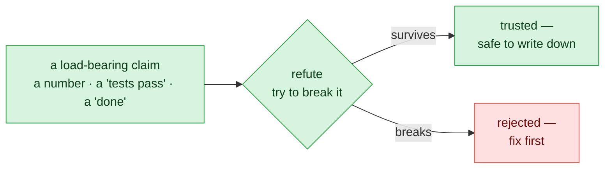
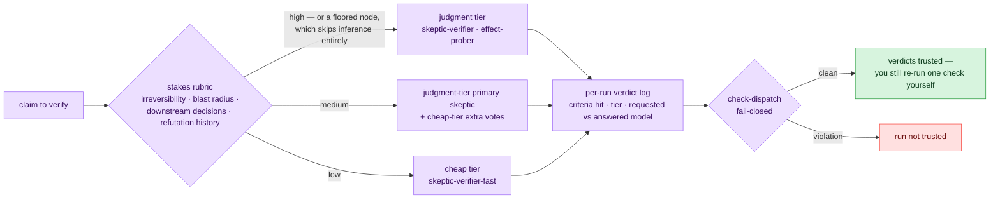
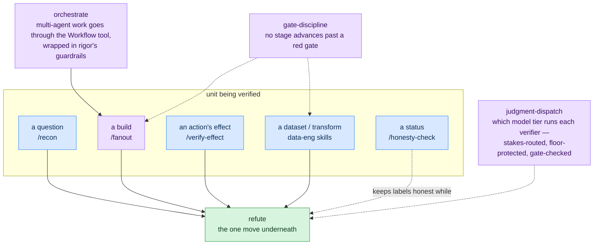
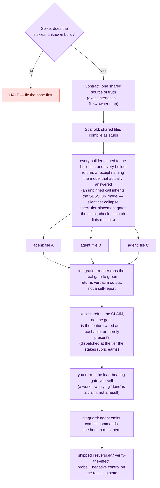

# rigor — verification & discipline for Claude Code

**A plugin that stops you from trusting an agent's self-reported success.**
Before "tests pass", "deployed", or "done" is believed, rigor makes the agent
try to break the claim — and blocks it from writing your git history while
it's at it. And because a check is only as strong as the model running it,
rigor routes every verifier dispatch by stakes: a premium **judgment tier**
where a wrong claim is expensive, a cheap tier where it isn't — enforced by
gates, not prose ([model-tier dispatch](#model-tier-dispatch-putting-the-expensive-model-where-it-counts)).

## The problem it exists for

Agent output often *looks* finished: a green test run, a confident summary, an
exit code 0. Too often the test exercised a bypass fixture, the number was
restated from memory instead of recomputed from the source, or the feature
compiles but was never wired in. rigor calls this a **correct-shaped lie** —
output with the form of correctness but not the evidence. Every component
below is one defense against it.

The core move is **refute**: don't accept a claim, attack it.



Everything else in the plugin is that one move specialized onto a bigger unit —
a question, a build, a deploy's aftermath, a dataset.

Two terms, defined once and used throughout:

- **load-bearing claim** — a claim a decision rests on. "Tests pass" before a
  merge is load-bearing; a passing lint note is not.
- **negative control** — a check that must *fail* when the thing it checks for
  is absent. A probe that would pass either way proves nothing (rigor calls
  that a **vacuous probe** and refuses to credit it).

## Which command, when

| You're about to trust… | Run | What actually happens |
|---|---|---|
| a number, a "tests pass", any agent's "done" | `/rigor:verify-claim` | `refute`: recompute from the raw source, re-run the real gate, dispatch skeptic subagents, check cited sources actually say what's claimed |
| a status doc, README, or commit message | `/rigor:honesty-check` | `implemented-vs-planned`: every claim gets tagged built / in-progress / planned, so proposals can't read as finished work |
| a question too big for one pass | `/rigor:recon` | `fanout-recon-synthesize`: split into disjoint parallel research, refute the findings, synthesize only the survivors |
| a build too big for one pass | `/rigor:fanout` | `fanout-build`: contract-first multi-agent build with an integration gate and a skeptic pass (diagram below) |
| a deploy / migration / publish that "succeeded" | `/rigor:verify-effect` | `verify-the-effect`: probe the state the action left behind, paired with a negative control — never the action's own exit log |
| the next session (or person) picking this up | `/rigor:handoff` | emits a fixed "read this first" brief: state, locked decisions, invariants — every built claim carrying a `re-verify:` line for the pick-up at the other end |
| a handoff brief you've just been handed | `/rigor:pickup` | `pick-up`: refute the brief's load-bearing claims against the current repo, detect drift since it was written, re-run the entry gate — build only on what verified *now* |

Two hooks run without being asked:

- **`git-guard`** — blocks agent-initiated `git commit` / `push` / history
  rewrites; the agent outputs the command for *you* to run instead. Per-repo
  override: `RIGOR_GIT_ALLOW=1`.
- **`session-start`** — injects a one-paragraph toolkit pointer into every
  session so the discipline is present before the first claim is made.

## What's code and what's judgment

Worth being precise about, because it kills the most likely misread:
**rigor is not an automated validator for your project.**

- **Executes as code:** the 2 hooks above, plus 6 check scripts —
  `check-surface-scrub` (no project-specific fingerprints leak into shipped
  examples), `check-citation-fidelity` (every cited identifier/quote exists in
  its named source), `check-effect-probe` (an effect claim is credited only if
  its probe passed *and* its negative control failed), `check-fanout` (a
  multi-agent workflow script carries a contract, integration step, and verify
  phase), `check-dispatch` (every verifier dispatch logged its stakes
  inference; floored nodes stayed on the judgment tier; no silent model
  downgrades), `check-tier-sync` (agent frontmatter agrees with
  `config/models.json`; tier variants share one canonical body). All run under
  `node --test`.
- **Applied as judgment:** the 13 skills, 7 commands, and 5 agents are
  discipline the agent applies *inside your repo*, against *your* gates. rigor
  deliberately ships no turnkey pipeline validator — a shipped checker that
  certified pipelines whose schema it can't know would itself be a
  correct-shaped lie
  ([ADR-0002](docs/adr/0002-dataeng-is-judgment-not-a-universal-gate.md)).

## Model-tier dispatch: putting the expensive model where it counts

A check is only as strong as the model running it — and premium tokens are
exactly what you don't want to spend on a lint note. rigor already separates
**judgment nodes** (adversarial verification: skeptics, effect probes, verdict
cross-checks) from **mechanical nodes** (the deterministic `check-*` gates,
which need no model at all). `judgment-dispatch` finishes the thought: which
model runs a judgment node is an architectural decision enforced by a gate,
not a per-call accident. Verifiers route across two tiers — a premium
**judgment tier** (shipped default: Claude Fable 5) and a **cheap tier**
(shipped default: Claude Sonnet 5) — via an explicit stakes rubric the
orchestrator must apply *and log* before every dispatch. Workers get a third
lane: builders, the integration closer, and mappers run on the **build tier**
(also Sonnet 5 by default) — the judgment tier is never spent writing the code
it will later have to judge.



The hazard this contains is rigor's own self-report problem, appearing inside
its dispatch: stakes are inferred by the same agent whose claims are being
checked, so an agent that under-rates stakes buys itself cheap verification
exactly where the strong skeptic matters most. Three mechanical answers:

- **The inference is itself a logged, refutable claim.** Every dispatch
  records which rubric criteria fired; `check-dispatch` fails closed on an
  unlogged one, and a high-stakes marker paired with a cheap-tier verifier is
  flagged even when the declared stakes say "low".
- **Floors are beyond inference's reach.** Floored nodes —
  `verify-the-effect`'s verdict cross-check, the pre-publish honesty check —
  always get the judgment tier, listed in `config/models.json` and enforced by
  the gate, not by prose.
- **Downgrades are never silent.** The verdict logs the requested *and* the
  answering model; a substitution without `downgraded: true` fails the gate.

Model *strings* live in exactly two places — `config/models.json` and agent
frontmatter, held together by `check-tier-sync` (which also verifies the two
skeptic variants share one canonical prompt body byte-for-byte) — so model
churn is a config edit, not a prose hunt. The pin mechanism is live-verified
with a non-vacuous probe ([build record](docs/plans/2026-07-07-judgment-dispatch-plan.md));
the rubric itself hasn't survived an independent domain yet (status table
below).

## How the layers fit



### Worked example: a fan-out build

A feature too big for one pass, with rigor loaded:



Why each step is there: the **contract** is what keeps parallel agents from
drifting apart; **disjoint file ownership** is what keeps them from colliding;
the **integration gate** produces evidence instead of a summary; the **skeptic
pass** catches the green-gate-but-unwired case; and the final **re-run by you**
exists because a workflow's self-reported success is exactly the kind of claim
this plugin refuses to trust. The **tier pins and receipts** are what make the
swarm *real* rather than apparent: an unpinned `agent()` call inherits the
session model — and `agentType:` alone does not pin (an agent whose frontmatter
says `model: inherit` still collapses) — so a fan-out can look like a swarm of
cheap specialized workers while the expensive orchestrating model silently does
all the work. Every builder is pinned to the build tier (sourced from
`config/models.json`, never a hardcoded literal), `check-tier-placement` gates
the script before it runs, and each worker's receipt makes a collapse a
**logged event** in the run's own artifact instead of post-hoc transcript
archaeology (ADR-0006, verified against a real collapsed run).

## Data-engineering layer

The same move aimed at properties of data and transforms. Each skill names a
failure that leaves the pipeline green while the data is wrong:

- **`data-quality-fail-closed`** — a data-quality check has *three* outcomes:
  pass, fail, and **unevaluable** (the check itself couldn't run — empty
  partition, missing reference table). Fail-closed means unevaluable **halts**
  the pipeline instead of being silently coerced into pass or fail.
- **`no-lookahead`** — in point-in-time data, no row may depend on information
  timestamped after that row's moment. The leak is tested with a
  **restatement** — a late-arriving correction to a past period — because
  append-only test data can pass while the same code leaks on corrections.
- **`idempotent-restatement`** — running the pipeline twice must not
  double-count, and two records with the same key must resolve by an explicit,
  *tested* tiebreak. Proven by running twice and diffing, not asserted.
- **`lineage-replay`** — "we can reproduce this dataset" is only true if the
  replay is re-executed and diffed; every published batch carries a
  content-addressed identity so "same input" is checkable, not remembered.
- **`refute` move 5: test-path fidelity** — a green test that exercised a
  bypass fixture (a stub path the production flow never takes) validates
  nothing. The refutation is to trace what the test actually ran.

Known limit, kept visible on purpose: every check above fires **at a moment**
— nothing here yet owns re-auditing *standing* published data as upstream
reality drifts after the publish. That gap is named, not hidden
([ADR-0005](docs/adr/0005-wap-composition-and-catalog-drift.md), proposed —
not ratified); the re-audit sweep it proposes stays out of this list until it
has actually fired.

Deliberately **not** shipped: an automated validator that runs these checks
for you — see ADR-0002 above. The skills ship the attack moves and the
claim-calibration language; the agent applies them against your schema.

## Status: what's proven, what isn't

rigor applies its own standard to itself. Every component is **provisional**
(extracted from real working sessions, not yet survived ≥2 *independent*
domains as a packaged component) until the ledger in
[`docs/feedback/FEEDBACK.md`](docs/feedback/FEEDBACK.md) — the source of
truth this table tracks — records the promotion. "Settled (scoped)" means
settled *for the named scope only*, with unproven reach kept visible.

| Component | Kind | Status |
|---|---|---|
| `refute` | skill | **settled (scoped)** — 2 domains, for numeric provenance + citation fidelity; reach over semantic/design/omission defects unproven; data-claim moves provisional |
| `skeptic-verifier` | agent | **settled** — 2 domains, **1 logged misfire** (2/4 false refutations on its one independent fan-out domain, caught only by the orchestrator's own re-run) |
| `fanout-build` | skill | **settled (scoped)** — 2 independent domains end-to-end; caveat: same operator both times, second domain smaller with an unstressed verify phase |
| `effect-prober` | agent | **settled (scoped)** — 3 non-vacuous probes, self-verified; unproven: an independent oracle, and the aftermath of a genuine live irreversible action |
| `verify-the-effect` | skill | **settled (scoped)** — 2 domains; the live end-to-end probe gap is closed (paired negative controls, non-vacuity proven by recovery). Unproven: an oracle independent of the gate under test, and a genuinely irreversible external action |
| `pick-up` | skill | **settled (scoped)** — 2 domains; domain 2 is the first time it killed a claim (refuted a recorded test count against its own commit anchor). Unproven: picking up a brief written by someone else |
| `implemented-vs-planned`, `fanout-recon-synthesize`, `orchestrate` | skills | provisional (1 independent domain each) |
| `gate-discipline` | skill | provisional — 1 domain (first firing 2026-07-14: refused to credit a built-but-unmerged ADR as accepted) |
| ledger kit (`docs/learnings/` + `docs/handoff/`) | convention + gate | provisional — 1 domain, **1 logged misfire**: its first non-origin use produced a record whose basis did not reproduce, and the form gate passed it green. Hardened; the limit stands — a form gate never verifies that a basis is genuine |
| `data-quality-fail-closed`, `no-lookahead`, `idempotent-restatement`, `lineage-replay` | skills | provisional — built 2026-07-02, no independent data-eng domain survived yet. A publish-boundary firing was designated 2026-07-18 to their **origin** repo (ADR-0005 addendum): it exercises the discipline but cannot count as the independent domain |
| `judgment-dispatch` | skill | provisional — built 2026-07-07; its frontmatter pin mechanism is live-verified (non-vacuous probe, [plan](docs/plans/2026-07-07-judgment-dispatch-plan.md)), but no independent domain has run through the rubric yet |
| `integration-runner`, `repo-cartographer`, `skeptic-verifier-fast` | agents | provisional (`skeptic-verifier-fast` shares the settled canonical body, but its cheap-tier verdict quality is unproven) |
| all 7 commands, both hooks, all 8 check scripts | commands / hooks / gates | provisional (`check-citation-fidelity` carries a logged limit: insufficient for numeric provenance; `check-tier-placement` built 2026-07-18, non-vacuity verified red on a real collapsed run, no independent domain yet) |

The misfires stay in the table on purpose — a verification toolkit that hides
its own false refutations would be its own counterexample. Full dated entries:
[`docs/feedback/`](docs/feedback/) — filenames are `YYYY-MM-DD-<topic>.md`, so
the listing reads oldest-first; scroll to the bottom for the newest entries.

## Install

This repo is its own local plugin marketplace. In a Claude Code session:

```
/plugin marketplace add <absolute-path-to-this-repo>
/plugin install rigor@rigor
```

Commands are namespaced: `/rigor:verify-claim`, `/rigor:honesty-check`,
`/rigor:recon`, `/rigor:handoff`, `/rigor:pickup`, `/rigor:fanout`,
`/rigor:verify-effect`. Skills and agents auto-activate with the plugin.

For cross-repo availability, register it in `~/.claude/settings.json`:

```json
{
  "extraKnownMarketplaces": {
    "rigor": { "source": { "source": "directory", "path": "<absolute-path-to-this-repo>" } }
  },
  "enabledPlugins": { "rigor@rigor": true }
}
```

The `SessionStart` hook delivers the toolkit pointer automatically on current
Claude Code. If your version doesn't surface it, use the manual registration
in [`docs/session-start-setup.md`](docs/session-start-setup.md); the slash
commands work either way.

## Tests

```
node --test                                  # hooks + all 7 check scripts, auto-discovered from tests/
node scripts/check-surface-scrub.mjs         # shipped examples carry no project fingerprints
node scripts/check-citation-fidelity.mjs <claims.json>
node scripts/check-effect-probe.mjs <probes.json>
node scripts/check-fanout.mjs <workflow.mjs>
node scripts/check-dispatch.mjs <verdicts.jsonl>   # verifier dispatches logged, floored, no silent downgrades
node scripts/check-tier-sync.mjs                   # agent frontmatter agrees with config/models.json
node scripts/check-learnings.mjs docs/learnings    # ledger entries anchored, append-only, index↔folder consistent
```

Also in `scripts/` (a utility, not a gate): `extract-tails.mjs` emits a
per-session routing index from local harness transcripts — its output is a
regenerable cache that belongs *outside* any repo.

## Going deeper

- Design rationale: [`docs/specs/2026-06-25-rigor-plugin-design.md`](docs/specs/2026-06-25-rigor-plugin-design.md)
- Model-tier dispatch design + build record: [`docs/specs/2026-07-05-judgment-dispatch-design.md`](docs/specs/2026-07-05-judgment-dispatch-design.md), [`docs/plans/2026-07-07-judgment-dispatch-plan.md`](docs/plans/2026-07-07-judgment-dispatch-plan.md)
- Build order and task plan: [`docs/plans/2026-06-25-rigor-plugin-phase1.md`](docs/plans/2026-06-25-rigor-plugin-phase1.md)
- ADRs + status table (decided vs. as-built): [`docs/adr/README.md`](docs/adr/README.md) — including why there is no universal data validator (ADR-0002)
- Ledger kit (learnings + handoff folders, tails index): [`docs/plans/2026-07-12-ledger-kit-plan.md`](docs/plans/2026-07-12-ledger-kit-plan.md)
- Self-audit (37 findings, fixes independently verified): [`docs/audits/2026-06-25-spine-audit.md`](docs/audits/2026-06-25-spine-audit.md)
- Promotion ledger + dated feedback entries: [`docs/feedback/`](docs/feedback/) (chronological — newest at the bottom)
- Measured comparison vs. superpowers / SuperML / Anthropic's Data plugin: [`docs/comparisons/2026-07-03-plugin-landscape-scorecard.md`](docs/comparisons/2026-07-03-plugin-landscape-scorecard.md)
