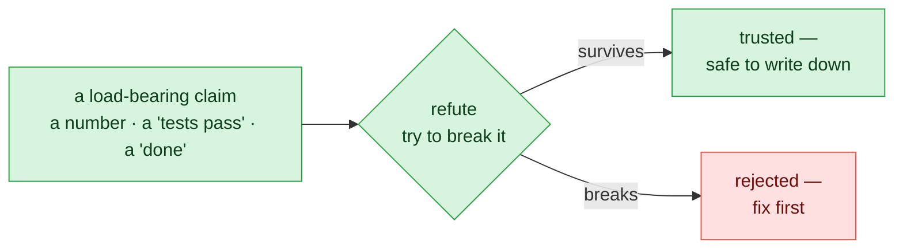
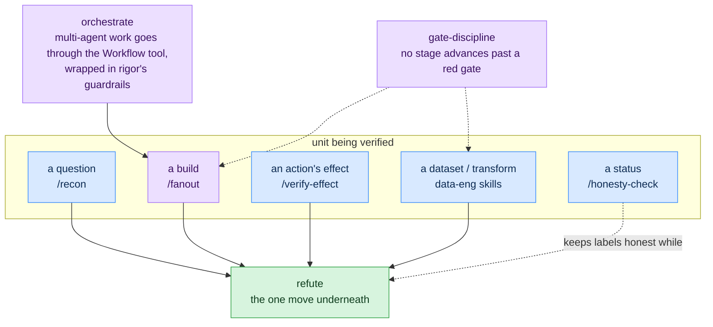
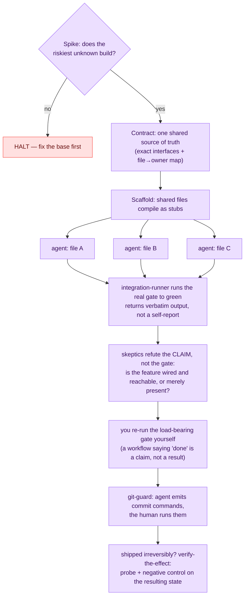

# rigor — verification & discipline for Claude Code

**A plugin that stops you from trusting an agent's self-reported success.**
Before "tests pass", "deployed", or "done" is believed, rigor makes the agent
try to break the claim — and blocks it from writing your git history while
it's at it.

## The problem it exists for

Agent output often *looks* finished: a green test run, a confident summary, an
exit code 0. Too often the test exercised a bypass fixture, the number was
restated from memory instead of recomputed from the source, or the feature
compiles but was never wired in. rigor calls this a **correct-shaped lie** —
output with the form of correctness but not the evidence. Every component
below is one defense against it.

The core move is **refute**: don't accept a claim, attack it.



Everything else in the plugin is that one move specialized onto a bigger unit —
a question, a build, a deploy's aftermath, a dataset.

Two terms, defined once and used throughout:

- **load-bearing claim** — a claim a decision rests on. "Tests pass" before a
  merge is load-bearing; a passing lint note is not.
- **negative control** — a check that must *fail* when the thing it checks for
  is absent. A probe that would pass either way proves nothing (rigor calls
  that a **vacuous probe** and refuses to credit it).

## Which command, when

| You're about to trust… | Run | What actually happens |
|---|---|---|
| a number, a "tests pass", any agent's "done" | `/rigor:verify-claim` | `refute`: recompute from the raw source, re-run the real gate, dispatch skeptic subagents, check cited sources actually say what's claimed |
| a status doc, README, or commit message | `/rigor:honesty-check` | `implemented-vs-planned`: every claim gets tagged built / in-progress / planned, so proposals can't read as finished work |
| a question too big for one pass | `/rigor:recon` | `fanout-recon-synthesize`: split into disjoint parallel research, refute the findings, synthesize only the survivors |
| a build too big for one pass | `/rigor:fanout` | `fanout-build`: contract-first multi-agent build with an integration gate and a skeptic pass (diagram below) |
| a deploy / migration / publish that "succeeded" | `/rigor:verify-effect` | `verify-the-effect`: probe the state the action left behind, paired with a negative control — never the action's own exit log |
| the next session (or person) picking this up | `/rigor:handoff` | emits a fixed "read this first" brief: state, locked decisions, invariants |

Two hooks run without being asked:

- **`git-guard`** — blocks agent-initiated `git commit` / `push` / history
  rewrites; the agent outputs the command for *you* to run instead. Per-repo
  override: `RIGOR_GIT_ALLOW=1`.
- **`session-start`** — injects a one-paragraph toolkit pointer into every
  session so the discipline is present before the first claim is made.

## What's code and what's judgment

Worth being precise about, because it kills the most likely misread:
**rigor is not an automated validator for your project.**

- **Executes as code:** the 2 hooks above, plus 4 check scripts —
  `check-surface-scrub` (no project-specific fingerprints leak into shipped
  examples), `check-citation-fidelity` (every cited identifier/quote exists in
  its named source), `check-effect-probe` (an effect claim is credited only if
  its probe passed *and* its negative control failed), `check-fanout` (a
  multi-agent workflow script carries a contract, integration step, and verify
  phase). All run under `node --test`.
- **Applied as judgment:** the 11 skills, 6 commands, and 4 agents are
  discipline the agent applies *inside your repo*, against *your* gates. rigor
  deliberately ships no turnkey pipeline validator — a shipped checker that
  certified pipelines whose schema it can't know would itself be a
  correct-shaped lie
  ([ADR-0002](docs/adr/0002-dataeng-is-judgment-not-a-universal-gate.md)).

## How the layers fit



### Worked example: a fan-out build

A feature too big for one pass, with rigor loaded:



Why each step is there: the **contract** is what keeps parallel agents from
drifting apart; **disjoint file ownership** is what keeps them from colliding;
the **integration gate** produces evidence instead of a summary; the **skeptic
pass** catches the green-gate-but-unwired case; and the final **re-run by you**
exists because a workflow's self-reported success is exactly the kind of claim
this plugin refuses to trust.

## Data-engineering layer

The same move aimed at properties of data and transforms. Each skill names a
failure that leaves the pipeline green while the data is wrong:

- **`data-quality-fail-closed`** — a data-quality check has *three* outcomes:
  pass, fail, and **unevaluable** (the check itself couldn't run — empty
  partition, missing reference table). Fail-closed means unevaluable **halts**
  the pipeline instead of being silently coerced into pass or fail.
- **`no-lookahead`** — in point-in-time data, no row may depend on information
  timestamped after that row's moment. The leak is tested with a
  **restatement** — a late-arriving correction to a past period — because
  append-only test data can pass while the same code leaks on corrections.
- **`idempotent-restatement`** — running the pipeline twice must not
  double-count, and two records with the same key must resolve by an explicit,
  *tested* tiebreak. Proven by running twice and diffing, not asserted.
- **`lineage-replay`** — "we can reproduce this dataset" is only true if the
  replay is re-executed and diffed; every published batch carries a
  content-addressed identity so "same input" is checkable, not remembered.
- **`refute` move 5: test-path fidelity** — a green test that exercised a
  bypass fixture (a stub path the production flow never takes) validates
  nothing. The refutation is to trace what the test actually ran.

Deliberately **not** shipped: an automated validator that runs these checks
for you — see ADR-0002 above. The skills ship the attack moves and the
claim-calibration language; the agent applies them against your schema.

## Status: what's proven, what isn't

rigor applies its own standard to itself. Every component is **provisional**
(extracted from real working sessions, not yet survived ≥2 *independent*
domains as a packaged component) until the ledger in
[`docs/feedback/FEEDBACK.md`](docs/feedback/FEEDBACK.md) — the source of
truth this table tracks — records the promotion. "Settled (scoped)" means
settled *for the named scope only*, with unproven reach kept visible.

| Component | Kind | Status |
|---|---|---|
| `refute` | skill | **settled (scoped)** — 2 domains, for numeric provenance + citation fidelity; reach over semantic/design/omission defects unproven; data-claim moves provisional |
| `skeptic-verifier` | agent | **settled** — 2 domains, **1 logged misfire** (2/4 false refutations on its one independent fan-out domain, caught only by the orchestrator's own re-run) |
| `fanout-build` | skill | **settled (scoped)** — 2 independent domains end-to-end; caveat: same operator both times, second domain smaller with an unstressed verify phase |
| `effect-prober` | agent | **settled (scoped)** — 3 non-vacuous probes, self-verified; unproven: an independent oracle, and the aftermath of a genuine live irreversible action |
| `implemented-vs-planned`, `gate-discipline`, `verify-the-effect`, `fanout-recon-synthesize`, `orchestrate` | skills | provisional (each has 1 independent domain logged except `gate-discipline`: 0) |
| `data-quality-fail-closed`, `no-lookahead`, `idempotent-restatement`, `lineage-replay` | skills | provisional — built 2026-07-02, no independent data-eng domain survived yet |
| `integration-runner`, `repo-cartographer` | agents | provisional |
| all 6 commands, both hooks, all 4 check scripts | commands / hooks / gates | provisional (`check-citation-fidelity` carries a logged limit: insufficient for numeric provenance) |

The misfires stay in the table on purpose — a verification toolkit that hides
its own false refutations would be its own counterexample. Full dated entries:
[`docs/feedback/`](docs/feedback/).

## Install

This repo is its own local plugin marketplace. In a Claude Code session:

```
/plugin marketplace add <absolute-path-to-this-repo>
/plugin install rigor@rigor
```

Commands are namespaced: `/rigor:verify-claim`, `/rigor:honesty-check`,
`/rigor:recon`, `/rigor:handoff`, `/rigor:fanout`, `/rigor:verify-effect`.
Skills and agents auto-activate with the plugin.

For cross-repo availability, register it in `~/.claude/settings.json`:

```json
{
  "extraKnownMarketplaces": {
    "rigor": { "source": { "source": "directory", "path": "<absolute-path-to-this-repo>" } }
  },
  "enabledPlugins": { "rigor@rigor": true }
}
```

The `SessionStart` hook delivers the toolkit pointer automatically on current
Claude Code. If your version doesn't surface it, use the manual registration
in [`docs/session-start-setup.md`](docs/session-start-setup.md); the slash
commands work either way.

## Tests

```
node --test                                  # hooks + all 4 check scripts, auto-discovered from tests/
node scripts/check-surface-scrub.mjs         # shipped examples carry no project fingerprints
node scripts/check-citation-fidelity.mjs <claims.json>
node scripts/check-effect-probe.mjs <probes.json>
node scripts/check-fanout.mjs <workflow.mjs>
```

## Going deeper

- Design rationale: [`docs/specs/2026-06-25-rigor-plugin-design.md`](docs/specs/2026-06-25-rigor-plugin-design.md)
- Build order and task plan: [`docs/plans/2026-06-25-rigor-plugin-phase1.md`](docs/plans/2026-06-25-rigor-plugin-phase1.md)
- ADRs: [`docs/adr/`](docs/adr/) — including why there is no universal data validator (ADR-0002)
- Self-audit (37 findings, fixes independently verified): [`docs/audits/2026-06-25-spine-audit.md`](docs/audits/2026-06-25-spine-audit.md)
- Promotion ledger + dated feedback entries: [`docs/feedback/`](docs/feedback/)
