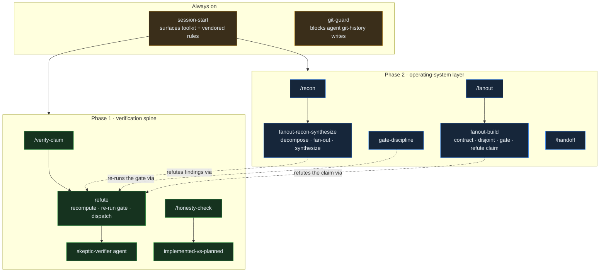
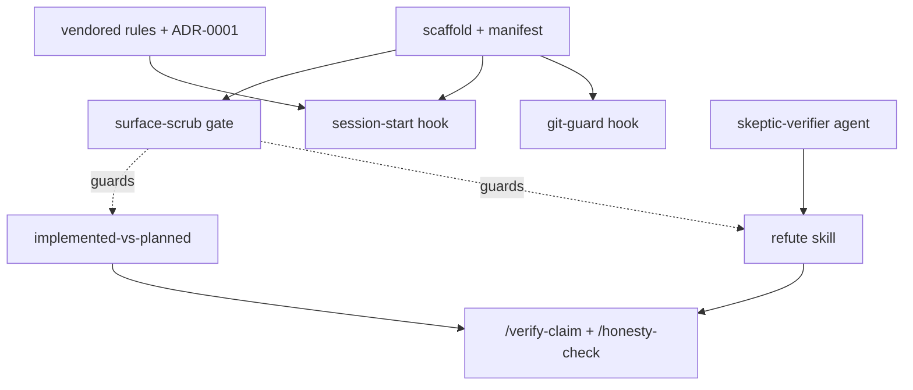

# rigor — verification & discipline for Claude Code

**rigor** packages the operating discipline of a careful engineer into a portable
Claude Code plugin. Its **verification spine** (Phase 1) refutes load-bearing
claims before they are trusted, keeps the built-vs-planned line honest, and never
lets an agent write your git history. Its **operating-system layer** (Phase 2)
adds the wider loop: decompose a question into disjoint parallel recon and keep
only what survives refutation, hold staged work to its gates, and hand off clean.
Every example is domain-neutral, so a clone reads as nobody's specific stack.

## How it works

A layered workflow: two always-on hooks frame every session, the **verification
spine** breaks load-bearing claims, and the **operating-system layer** runs the
wider recon → refute → synthesize → gate → handoff loop. The commands are thin
entry points; the skills carry the judgment; the agent and hooks do the enforcing.

## What's in v1 (the verification spine)

Listed in **build order** — enforcement infra lands before the content it guards.

| Component | Kind | Status |
|---|---|---|
| `git-guard` | hook (enforced) | provisional |
| `session-start` | hook | provisional |
| `skeptic-verifier` | agent | provisional |
| `refute` | skill | provisional |
| `implemented-vs-planned` | skill | provisional |
| `/verify-claim`, `/honesty-check` | commands | provisional |

**`status: provisional` means:** *extracted from one working session and not yet
validated as a packaged skill across multiple unfamiliar domains.* It does **not**
mean "used only once" — these patterns have cross-project history. The status field
is read by **this README only**; it is not a functional gate. A component becomes
`settled` after it survives ≥2 independent contexts (logged in `FEEDBACK.md`).

## Phase 2 (operating-system layer)

| Component | Kind | Status |
|---|---|---|
| `fanout-recon-synthesize` | skill | provisional (exercised once — see `FEEDBACK.md`) |
| `gate-discipline` | skill | provisional |
| `/recon` | command | provisional |
| `/handoff` | command + template | provisional |

`fanout-recon-synthesize` is the decompose → fan-out → refute → synthesize loop;
`/recon` is its thin caller. A runnable, domain-neutral example of the proven
shape ships at `skills/fanout-recon-synthesize/example.mjs` — it is the loop that
audited this toolkit's own spine. `gate-discipline` keeps staged work honest
(no stage past a red gate; close via real integration; ADR a deviation rather
than bury it). `/handoff` emits a fixed "read this first" brief.

## Phase 3 (orchestration discipline)

| Component | Kind | Status |
|---|---|---|
| `fanout-build` | skill | provisional |
| `/fanout` | command | provisional |
| `check-fanout` | gate (heuristic) | provisional |

`fanout-build` packages the trustworthy multi-agent **build** — one shared
contract, disjoint-file ownership, scaffold-first, an `integration-runner` gate,
and a `skeptic-verifier` pass that refutes the *claim* (a green gate is not a true
claim). `/fanout` is its entry point; `check-fanout` flags a fan-out workflow
script missing that scaffolding (structure only — it cannot prove file-disjointness
or that a claim is true). Grounded in two independent real multi-agent builds.

## Build order (the dependency spine)

Enforcement infra (`git-guard`, the `surface-scrub` gate) is built before the
content it guards; `refute` is built before the two commands that call it. Full
task-by-task plan: [`docs/plans/2026-06-25-rigor-plugin-phase1.md`](docs/plans/2026-06-25-rigor-plugin-phase1.md);
design rationale: [`docs/specs/2026-06-25-rigor-plugin-design.md`](docs/specs/2026-06-25-rigor-plugin-design.md).

## Install

Add this repo as a local Claude Code plugin (see current Claude Code plugin docs).
The `SessionStart` hook needs a one-time `~/.claude/settings.json` registration to
deliver context — see [`docs/session-start-setup.md`](docs/session-start-setup.md).

## The one hard rule

`git-guard` blocks agent-initiated git-history writes; Claude outputs the command
for you to run instead. Override per web-driven repo with `RIGOR_GIT_ALLOW=1`.

The full self-audit (37 findings — spine code fixes applied and independently
verified) is in [`docs/audits/2026-06-25-spine-audit.md`](docs/audits/2026-06-25-spine-audit.md).

## Tests

`node --test` (auto-discovers `tests/*.test.mjs` — hooks + surface-scrub).
`node scripts/check-surface-scrub.mjs` gates skill/command examples against
project fingerprints.

## Agents

Three vendored agents live in [`agents/`](agents/), each tagged `provisional` —
`skeptic-verifier`, `repo-cartographer`, `integration-runner`. See each file for
what it does and when to use it. Promotion `provisional` → `settled` is tracked in
`FEEDBACK.md`.
