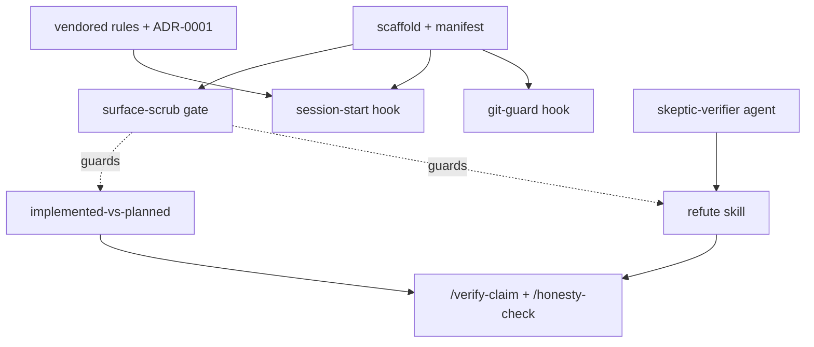

# rigor

A portable Claude Code plugin packaging a verification-and-discipline toolkit:
refute load-bearing claims, keep built-vs-planned honest, and never let an agent
write git history.

## What's in v1 (the verification spine)

Listed in **build order** — enforcement infra lands before the content it guards.

| Component | Kind | Status |
|---|---|---|
| `git-guard` | hook (enforced) | provisional |
| `session-start` | hook | provisional |
| `skeptic-verifier` | agent | provisional |
| `refute` | skill | provisional |
| `implemented-vs-planned` | skill | provisional |
| `/verify-claim`, `/honesty-check` | commands | provisional |

**`status: provisional` means:** *extracted from one working session and not yet
validated as a packaged skill across multiple unfamiliar domains.* It does **not**
mean "used only once" — these patterns have cross-project history. The status field
is read by **this README only**; it is not a functional gate. A component becomes
`settled` after it survives ≥2 independent contexts (logged in `FEEDBACK.md`).

## Phase 2 (operating-system layer)

| Component | Kind | Status |
|---|---|---|
| `fanout-recon-synthesize` | skill | provisional (exercised once — see `FEEDBACK.md`) |
| `gate-discipline` | skill | provisional |
| `/recon` | command | provisional |
| `/handoff` | command + template | provisional |

`fanout-recon-synthesize` is the decompose → fan-out → refute → synthesize loop;
`/recon` is its thin caller. A runnable, domain-neutral example of the proven
shape ships at `skills/fanout-recon-synthesize/example.mjs` — it is the loop that
audited this toolkit's own spine. `gate-discipline` keeps staged work honest
(no stage past a red gate; close via real integration; ADR a deviation rather
than bury it). `/handoff` emits a fixed "read this first" brief.

## Build order (the dependency spine)

Enforcement infra (`git-guard`, the `surface-scrub` gate) is built before the
content it guards; `refute` is built before the two commands that call it. Full
task-by-task plan: [`docs/plans/2026-06-25-rigor-plugin-phase1.md`](docs/plans/2026-06-25-rigor-plugin-phase1.md);
design rationale: [`docs/specs/2026-06-25-rigor-plugin-design.md`](docs/specs/2026-06-25-rigor-plugin-design.md).

## Install

Add this repo as a local Claude Code plugin (see current Claude Code plugin docs).

> **SessionStart caveat (verified 2026-06-25):** a plugin's `hooks.json`
> `SessionStart` hook does **not** currently surface `additionalContext` to Claude
> — it returns only a generic success message (upstream
> [claude-code#16538](https://github.com/anthropics/claude-code/issues/16538),
> closed as not planned). So the `using-rigor` pointer and the vendored-rules
> injection do **not** reach the model via the plugin path alone. To actually
> receive them, register `hooks/session-start.mjs` in your **`~/.claude/settings.json`**
> as well. Until then, treat the toolkit's self-introduction as degraded, not
> self-contained.

## The one hard rule

`git-guard` blocks agent-initiated git-history writes; Claude outputs the command
for you to run instead. Override per web-driven repo with `RIGOR_GIT_ALLOW=1`.

> **Coverage caveat (self-audit 2026-06-25, independently re-verified):** the
> current matcher catches `commit` / `push` / `branch -f|-D` / `reset --hard` /
> `--no-verify` / `--force`, but **13 other history-writing forms slip through**
> — `rebase`, `cherry-pick`, `merge`, `am`, `revert`, `filter-branch`,
> `fast-import`, `update-ref`, `reset --soft|--mixed`, `tag -f|-d`,
> `reflog delete|expire`, plus structural bypasses (`VAR=x git commit`,
> `git -C <dir> commit`, `$(git commit …)`). Two read-only commands are also wrongly
> blocked (`git fetch --force`, `git log --grep=--force`). Treat git-guard today as
> **provisional defense-in-depth, not a complete boundary**; remediation is the top
> item in the audit below.

## Known limitations

A 2026-06-25 self-audit (the toolkit's own `fanout-recon-synthesize` loop run
against its spine) surfaced 37 findings; the load-bearing ones above were
re-verified by hand. Full severity-ranked report with fixes:
[`docs/audits/2026-06-25-spine-audit.md`](docs/audits/2026-06-25-spine-audit.md).
The git-guard bypasses and the SessionStart limitation are confirmed; the rest
(hook import side-effects, surface-scrub boundary regex, denylist over-breadth)
are pending fix.

## Tests

`node --test` (auto-discovers `tests/*.test.mjs` — hooks + surface-scrub).
`node scripts/check-surface-scrub.mjs` gates skill/command examples against
project fingerprints.

## Roadmap

See `BACKLOG.md` — the held agents (`repo-cartographer`, `integration-runner`)
migrate only when they actually fire as named agents; promotion from
`provisional` → `settled` is earned by independent use and logged in `FEEDBACK.md`.
