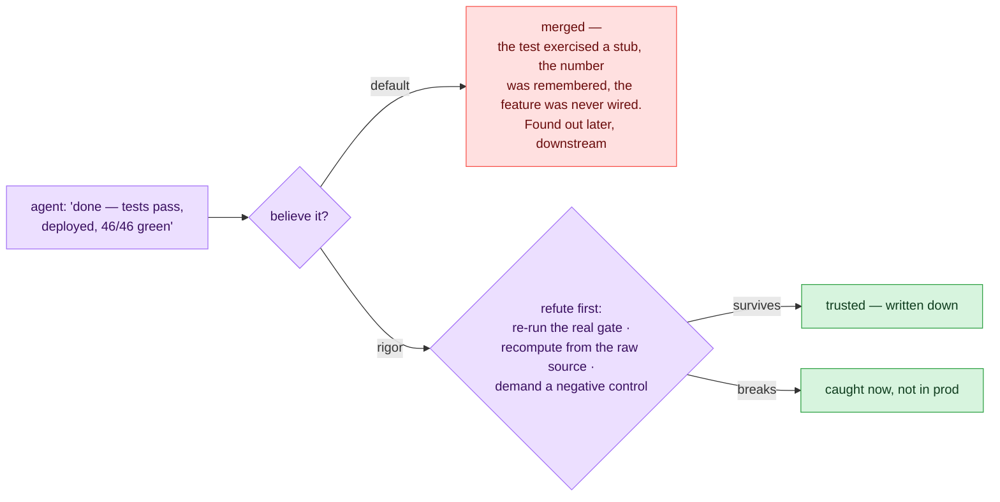

# rigor — verification & discipline for Claude Code

**Stops you from trusting an agent's self-reported success.** Agent output
often *looks* finished — a green test run, a confident summary, exit code 0 —
while the test exercised a bypass fixture, the number was restated from memory,
or the feature compiles but was never wired in. rigor calls this a
**correct-shaped lie**, and every component in the plugin is one defense
against it: before "tests pass", "deployed", or "done" is believed, the agent
must try to **break** the claim.



Why believe the premise? Three specimens from this repo's **own ledger** — the
toolkit applied to itself, misfires kept visible:

- A handoff brief recorded **"39 tests passed"** at its own commit anchor;
  re-running the suite gave **46**. Every required field was present and the
  form gate was green — the basis was still fiction. A form gate is a floor,
  never a verdict.
  ([the kill](docs/feedback/2026-07-14-pick-up-tic-brief-killed-a-claim.md))
- rigor's own skeptic once returned **2 false refutations out of 4** on a
  fan-out — caught only because the orchestrator re-ran the gates itself.
  Verifier verdicts are claims too. ([STATUS](docs/STATUS.md))
- A multi-agent build that looked like a swarm of cheap specialized workers
  answered **505 of 505** turns on the expensive orchestrating model — every
  call was unpinned and silently inherited the session model. Invisible in the
  run's own artifacts; found by transcript archaeology; now a gate.
  ([ADR-0006](docs/adr/0006-silent-tier-collapse.md))

## What ships

- **Refute, don't accept** — the one move under everything: recompute from raw
  sources, re-run the real gate, dispatch adversarial skeptics, demand a
  negative control (a probe that would pass either way proves nothing).
- **Discipline, not content** — 13 skills, 7 commands, 5 agents applied as
  judgment inside *your* repo against *your* gates; deliberately no turnkey
  validator ([ADR-0002](docs/adr/0002-dataeng-is-judgment-not-a-universal-gate.md)).
- **The expensive model only where it counts** — verifier dispatch is
  stakes-routed across model tiers, floored for the nodes that matter,
  gate-checked for silent downgrades and silent tier collapse
  ([SYSTEM](docs/SYSTEM.md#model-tier-dispatch-putting-the-expensive-model-where-it-counts)).
- **Agents never write your git history** — a hook blocks `git commit`/`push`
  and the agent emits the commands for you to run.
- **Self-applied** — every component stays *provisional* until it survives ≥2
  independent domains, and the ledger keeps rigor's own misfires visible
  ([STATUS](docs/STATUS.md)).

## Which command, when

| You're about to trust… | Run | What actually happens |
|---|---|---|
| a number, a "tests pass", any agent's "done" | `/rigor:verify-claim` | `refute`: recompute from the raw source, re-run the real gate, dispatch skeptic subagents, check cited sources actually say what's claimed |
| a status doc, README, or commit message | `/rigor:honesty-check` | `implemented-vs-planned`: every claim gets tagged built / in-progress / planned, so proposals can't read as finished work |
| a question too big for one pass | `/rigor:recon` | `fanout-recon-synthesize`: split into disjoint parallel research, refute the findings, synthesize only the survivors |
| a build too big for one pass | `/rigor:fanout` | `fanout-build`: contract-first multi-agent build with tier-pinned workers, an integration gate, and a skeptic pass |
| a deploy / migration / publish that "succeeded" | `/rigor:verify-effect` | `verify-the-effect`: probe the state the action left behind, paired with a negative control — never the action's own exit log |
| the next session (or person) picking this up | `/rigor:handoff` | emits a fixed "read this first" brief: state, locked decisions, invariants — every built claim carrying a `re-verify:` line |
| a handoff brief you've just been handed | `/rigor:pickup` | `pick-up`: refute the brief's load-bearing claims against the current repo, detect drift, re-run the entry gate |

Two hooks run without being asked: **`git-guard`** (blocks agent-initiated git
history writes; per-repo override `RIGOR_GIT_ALLOW=1`) and **`session-start`**
(injects the toolkit pointer before the first claim is made).

## Install

This repo is its own local plugin marketplace. In a Claude Code session:

```
/plugin marketplace add <absolute-path-to-this-repo>
/plugin install rigor@rigor
```

Cross-repo registration and older-harness fallback:
[docs/DEVELOPMENT.md](docs/DEVELOPMENT.md).

## Tests

```
node --test          # hooks + all 8 check gates; stdlib-only, green is the merge floor
```

The full gate list, one line each: [docs/DEVELOPMENT.md](docs/DEVELOPMENT.md).

## Where things live

- [docs/SYSTEM.md](docs/SYSTEM.md) — how the layers fit: the refute move,
  code-vs-judgment, model-tier dispatch, the fan-out pipeline, the
  data-engineering layer
- [docs/STATUS.md](docs/STATUS.md) — what's proven and what isn't, misfires
  included
- [docs/DEVELOPMENT.md](docs/DEVELOPMENT.md) — tests, gates, install
- [docs/adr/](docs/adr/README.md) — decisions, decided vs. as-built
- [docs/README.md](docs/README.md) — the full docs index: ledgers
  (feedback / learnings / handoff), designs, audits, comparisons
- [AGENTS.md](AGENTS.md) — the canonical repo brief for sessions working here
