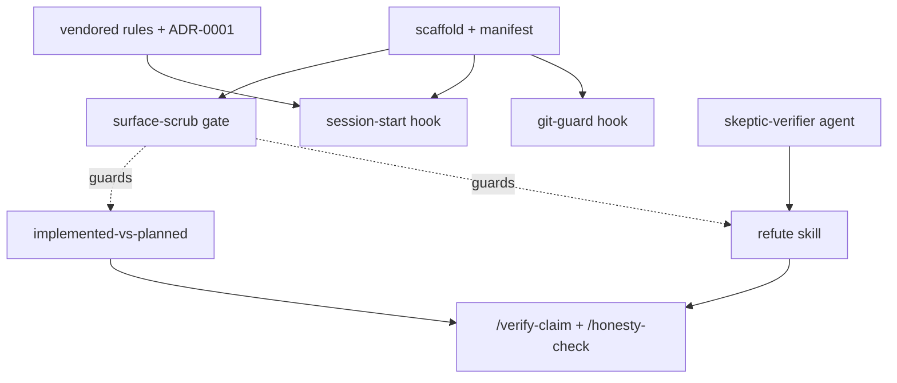

# rigor

A portable Claude Code plugin packaging a verification-and-discipline toolkit:
refute load-bearing claims, keep built-vs-planned honest, and never let an agent
write git history.

## What's in v1 (the verification spine)

Listed in **build order** — enforcement infra lands before the content it guards.

| Component | Kind | Status |
|---|---|---|
| `git-guard` | hook (enforced) | provisional |
| `session-start` | hook | provisional |
| `skeptic-verifier` | agent | provisional |
| `refute` | skill | provisional |
| `implemented-vs-planned` | skill | provisional |
| `/verify-claim`, `/honesty-check` | commands | provisional |

**`status: provisional` means:** *extracted from one working session and not yet
validated as a packaged skill across multiple unfamiliar domains.* It does **not**
mean "used only once" — these patterns have cross-project history. The status field
is read by **this README only**; it is not a functional gate. A component becomes
`settled` after it survives ≥2 independent contexts (logged in `FEEDBACK.md`).

## Build order (the dependency spine)

Enforcement infra (`git-guard`, the `surface-scrub` gate) is built before the
content it guards; `refute` is built before the two commands that call it. Full
task-by-task plan: [`docs/plans/2026-06-25-rigor-plugin-phase1.md`](docs/plans/2026-06-25-rigor-plugin-phase1.md);
design rationale: [`docs/specs/2026-06-25-rigor-plugin-design.md`](docs/specs/2026-06-25-rigor-plugin-design.md).

## Install

Add this repo as a local Claude Code plugin (see current Claude Code plugin docs).
On a machine without `~/.claude/rules`, the `session-start` hook injects the
vendored rules (`rules/`, see ADR-0001) so the toolkit is self-contained.

## The one hard rule

`git-guard` blocks agent-initiated `git commit`/`push`/force/`branch -f`. Claude
outputs the command for you to run. Override per web-driven repo with
`RIGOR_GIT_ALLOW=1`.

## Tests

`node --test` (auto-discovers `tests/*.test.mjs` — hooks + surface-scrub).
`node scripts/check-surface-scrub.mjs` gates skill/command examples against
project fingerprints.

## Roadmap

See `BACKLOG.md` — Phase 2 (gate-discipline, fanout-recon-synthesize, /recon,
/handoff) and held agents accrete by use.
