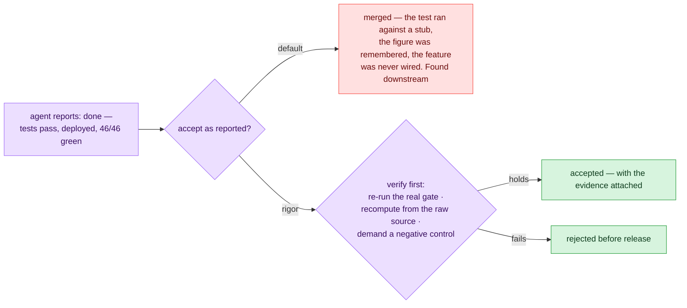

# rigor — verification controls for agentic software delivery

A Claude Code plugin that applies change-enablement discipline to work done by
agents: **a report of success is a claim, not evidence, and no claim is accepted
until it has been independently verified.** An agent's output is frequently
well-formed and wrong at the same time — a green test run that exercised a
stub, a figure restated from memory instead of recomputed, a feature that
compiles but was never wired in. Each component here is a control against that
class of defect: before "tests pass", "deployed", or "done" is accepted, the
agent must re-run the real gate, recompute from the raw source, and show a
negative control — and every irreversible step stays with a human.


```mermaid
flowchart LR
    C["agent reports: done —<br/>tests pass, deployed, 46/46 green"] --> D{"accept as reported?"}
    D -->|default| P["merged — the test ran against a stub,<br/>the figure was remembered, the feature<br/>was never wired. Found downstream"]
    D -->|rigor| R{"verify first:<br/>re-run the real gate ·<br/>recompute from the raw source ·<br/>demand a negative control"}
    R -->|holds| T["accepted — with the evidence attached"]
    R -->|fails| F["rejected before release"]

    classDef ok fill:#d7f4de,stroke:#2ea043,color:#0f3d1e;
    classDef bad fill:#ffe0e0,stroke:#f85149,color:#6a0d0d;
    classDef n fill:#ecdfff,stroke:#a371f7,color:#3a1060;
    class C,D,R n;
    class T,F ok;
    class P bad;
```

Why the premise holds: three findings from applying the toolkit to **its own
repository**, kept on the record rather than cleaned up —

- A handoff document recorded **39 tests passing** at its own commit;
  re-running the suite at that commit gave **46**. Every required field was
  present and the schema check was green. A schema check is a floor, never a
  verdict. ([record](docs/feedback/2026-07-14-pick-up-tic-brief-killed-a-claim.md))
- The adversarial reviewer itself returned **2 incorrect rejections out of 4**
  on one review pass — caught only because the orchestrator re-ran the gates
  independently. A reviewer's verdict is a claim like any other.
  ([status](docs/STATUS.md))
- A multi-agent build meant to run on lower-cost worker models answered
  **505 of 505** turns on the expensive orchestrating model: every call was
  unpinned and silently inherited the session's model. Invisible in the run's
  own artifacts; found in the transcripts; now enforced by a gate.
  ([decision](docs/DECISIONS.md#silent-tier-collapse))

## What ships

- **Verification before acceptance** — the control under everything:
  recompute from raw sources, re-run the real gate, dispatch independent
  adversarial reviewers, and require a negative control (a check that would
  pass whether or not the change worked proves nothing).
- **Judgment, not a generic validator** — 20 skills, 8 commands, and 5 agents
  that the agent applies inside *your* repository against *your* gates.
  Deliberately no turnkey validator: a checker that certified artifacts whose
  schema it cannot know would itself be unverified
  ([why](docs/DECISIONS.md#no-turnkey-validator)). Six of the twenty skills are
  the **deployment layer**, proposed 2026-08-22 and not yet validated in an
  independent codebase (see below).
- **Cost-aware model placement** — verifiers are routed across model tiers by
  the stakes of the claim, floored for the nodes that must never be cheapened,
  and gate-checked for silent downgrades and silent tier collapse
  ([how](docs/SYSTEM.md#model-tier-dispatch-putting-the-expensive-model-where-it-counts)).
- **Segregation of duties on git history** — a hook blocks agent-initiated
  history writes (including wrapped, flag-cluster, and remote-side `gh` forms);
  the agent emits the commands and a human runs them. The hook is friction
  that keeps the boundary visible, not a security boundary, and its
  documentation says so.
- **Segregation of duties on deployment** — a second hook refuses deploy-shaped
  commands (`kubectl apply`, `helm upgrade`, `terraform apply`, `gh workflow
  run`, …) unless a committed change record carries the required evidence, or
  a committed emergency-change record names who, when, and why
  ([the deployment layer](docs/DECISIONS.md#deployment-layer), **proposed**).
- **Applied to itself** — every component stays *provisional* until it has
  held up in at least two independent codebases, and the ledger keeps the
  toolkit's own failures visible ([status](docs/STATUS.md)).

## Newest layer: pre-change authorization (proposed)

The deployment layer supersedes the data-engineering layer as the latest
addition. The four data-engineering skills are **validated (within their
stated scope)** and unchanged; this layer is **proposed, fixture-tested, with
no independent codebase and no live run yet**, and every part of it remains
provisional until it has been shown to reject a known-bad change in a real
repository.

It sits *upstream* of post-implementation verification — before the
irreversible step, not after — and answers one question about an agent's
proposed change: **has it earned the right to proceed?** Six properties, each
implemented in the control shapes it can make fail (review, preventive,
detective, evidentiary):

| property | what must be true before the change proceeds |
|---|---|
| backout tested, not written | the backout path has **run against this candidate and exited 0**; a described plan is not evidence |
| release integrity | the artifact's content hash is recorded at review and recomputed at the execution edge; mismatch or an unrecomputable identity refuses |
| health signal fails closed | an SLI that cannot be read **halts** the change — never coerced to pass or fail — and only signals inside the declared blast radius are evaluated |
| post-implementation review with live evidence | a probe is not credited until a paired negative control shows it would fail if the change were absent |
| emergency change on the record | a bypass is written — who, when, why, the exact command — *before* it runs; an incomplete record is refused |
| change class earned, never declared | every pattern enters as an emergency-class change; only a human, on ledger evidence, demotes it toward standard, and one failure re-promotes it |

rigor is the control at the change-approval step. It is not the pipeline, the
change advisory board, the deploy executor, or an SRE platform. The design's
first draft was rejected by three independent reviewers and its first build by
nine; what ships is what survived five review rounds
([the decision](docs/DECISIONS.md#deployment-layer) ·
[build record](docs/plans/2026-08-22-deployment-layer-build.md)).

## Which command, when

| You're about to accept… | Run | What actually happens |
|---|---|---|
| a number, a "tests pass", any agent's "done" | `/rigor:verify-claim` | recompute from the raw source, re-run the real gate, dispatch independent reviewers, confirm cited sources say what is claimed |
| a status doc, README, or commit message | `/rigor:honesty-check` | every claim is tagged built / in-progress / planned so proposed work cannot read as finished |
| a question too big for one pass | `/rigor:recon` | split into disjoint parallel research, review the findings adversarially, keep only what survives |
| a build too big for one pass | `/rigor:fanout` | contract-first multi-agent build with tier-pinned workers, an integration gate, and an independent review pass |
| a deploy / migration / publish that "succeeded" | `/rigor:verify-effect` | probe the state the action left behind, paired with a negative control — never the action's own exit log |
| the next session (or person) picking this up | `/rigor:handoff` | a fixed "read this first" brief: state, locked decisions, invariants — every built claim carrying a re-verification command |
| a handoff brief you've just been handed | `/rigor:pickup` | re-verify the brief's load-bearing claims against the current repository, detect drift, re-run the entry gate |

Three hooks run without being asked: **`git-guard`** (blocks agent-initiated git
history writes; per-repository override `RIGOR_GIT_ALLOW=1`), **`change-guard`**
(refuses deploy-shaped commands without a committed change record or
emergency-change record — `RIGOR_CHANGE_RECORD`/`RIGOR_CHANGE_ID`, or
`RIGOR_BREAK_GLASS`; provisional), and **`session-start`** (injects the toolkit
pointer before the first claim is made).

## Install

This repository is its own local plugin marketplace. In a Claude Code session:

```
/plugin marketplace add <absolute-path-to-this-repo>
/plugin install rigor@rigor
```

Cross-repository registration and older-harness fallback:
[docs/DEVELOPMENT.md](docs/DEVELOPMENT.md).

## Tests

```
node --test          # hooks + all 11 check gates; stdlib-only, green is the merge floor
```

The full gate list, one line each: [docs/DEVELOPMENT.md](docs/DEVELOPMENT.md).

## Where things live

- [docs/SYSTEM.md](docs/SYSTEM.md) — how the layers fit: the verification
  control, code-vs-judgment, model-tier dispatch, the multi-agent build
  pipeline, the data-engineering layer (validated, scoped), and the deployment
  layer (proposed)
- [docs/STATUS.md](docs/STATUS.md) — what is validated and what is not,
  failures included
- [docs/DEVELOPMENT.md](docs/DEVELOPMENT.md) — tests, gates, install
- [docs/DECISIONS.md](docs/DECISIONS.md) — the decisions behind the claims on
  this page, each with its status and what is actually built
- [docs/README.md](docs/README.md) — the full docs index: ledgers
  (feedback / learnings / handoff), designs, audits, comparisons
- [AGENTS.md](AGENTS.md) — the canonical repository brief for sessions working here
