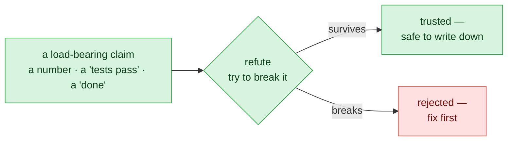
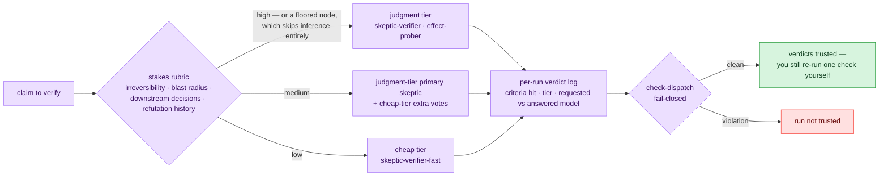
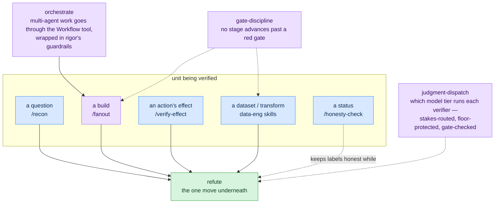
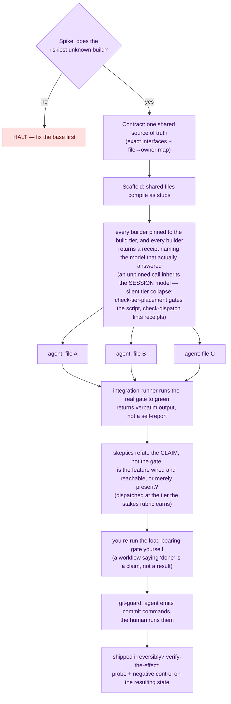

# The system: one move, specialized per unit

How rigor's layers fit together. State as of 2026-07-18. (Moved from the
README 2026-07-18; content unchanged except where dated.)

## The core move

The core move is **refute**: don't accept a claim, attack it.

Everything else in the plugin is that one move specialized onto a bigger unit —
a question, a build, a deploy's aftermath, a dataset.

Two terms, defined once and used throughout:

- **load-bearing claim** — a claim a decision rests on. "Tests pass" before a
  merge is load-bearing; a passing lint note is not.
- **negative control** — a check that must *fail* when the thing it checks for
  is absent. A probe that would pass either way proves nothing (rigor calls
  that a **vacuous probe** and refuses to credit it).

## What's code and what's judgment

Worth being precise about, because it kills the most likely misread:
**rigor is not an automated validator for your project.**

- **Executes as code:** the 2 hooks (`git-guard`, `session-start`), plus 8
  check scripts — `check-surface-scrub` (no project-specific fingerprints leak
  into shipped examples), `check-citation-fidelity` (every cited
  identifier/quote exists in its named source), `check-effect-probe` (an
  effect claim is credited only if its probe passed *and* its negative control
  failed), `check-fanout` (a multi-agent workflow script carries a contract,
  integration step, and verify phase), `check-tier-placement` (every
  non-verify `agent()` call carries a real tier pin — an unpinned call
  inherits the session model), `check-dispatch` (every verifier dispatch
  logged its stakes inference; floored nodes stayed on the judgment tier; no
  silent model downgrades — worker receipts share the same log),
  `check-tier-sync` (agent frontmatter agrees with `config/models.json`; tier
  variants share one canonical body), `check-learnings` (ledger entries
  anchored, append-only, index↔folder consistent). All run under `node --test`.
- **Applied as judgment:** the 13 skills, 7 commands, and 5 agents are
  discipline the agent applies *inside your repo*, against *your* gates. rigor
  deliberately ships no turnkey pipeline validator — a shipped checker that
  certified pipelines whose schema it can't know would itself be a
  correct-shaped lie
  ([ADR-0002](adr/0002-dataeng-is-judgment-not-a-universal-gate.md)).

## Model-tier dispatch: putting the expensive model where it counts

A check is only as strong as the model running it — and premium tokens are
exactly what you don't want to spend on a lint note. rigor already separates
**judgment nodes** (adversarial verification: skeptics, effect probes, verdict
cross-checks) from **mechanical nodes** (the deterministic `check-*` gates,
which need no model at all). `judgment-dispatch` finishes the thought: which
model runs a judgment node is an architectural decision enforced by a gate,
not a per-call accident. Verifiers route across two tiers — a premium
**judgment tier** (shipped default: Claude Fable 5) and a **cheap tier**
(shipped default: Claude Sonnet 5) — via an explicit stakes rubric the
orchestrator must apply *and log* before every dispatch. Workers get a third
lane: builders, the integration closer, and mappers run on the **build tier**
(also Sonnet 5 by default) — the judgment tier is never spent writing the code
it will later have to judge.

The hazard this contains is rigor's own self-report problem, appearing inside
its dispatch: stakes are inferred by the same agent whose claims are being
checked, so an agent that under-rates stakes buys itself cheap verification
exactly where the strong skeptic matters most. Three mechanical answers:

- **The inference is itself a logged, refutable claim.** Every dispatch
  records which rubric criteria fired; `check-dispatch` fails closed on an
  unlogged one, and a high-stakes marker paired with a cheap-tier verifier is
  flagged even when the declared stakes say "low".
- **Floors are beyond inference's reach.** Floored nodes —
  `verify-the-effect`'s verdict cross-check, the pre-publish honesty check —
  always get the judgment tier, listed in `config/models.json` and enforced by
  the gate, not by prose.
- **Downgrades are never silent.** The verdict logs the requested *and* the
  answering model; a substitution without `downgraded: true` fails the gate.

Model *strings* live in exactly two places — `config/models.json` and agent
frontmatter, held together by `check-tier-sync` (which also verifies the two
skeptic variants share one canonical prompt body byte-for-byte) — so model
churn is a config edit, not a prose hunt. The pin mechanism is live-verified
with a non-vacuous probe ([build record](plans/2026-07-07-judgment-dispatch-plan.md));
the rubric itself hasn't survived an independent domain yet
([STATUS](STATUS.md)).

## How the layers fit

### Worked example: a fan-out build

A feature too big for one pass, with rigor loaded:

Why each step is there: the **contract** is what keeps parallel agents from
drifting apart; **disjoint file ownership** is what keeps them from colliding;
the **integration gate** produces evidence instead of a summary; the **skeptic
pass** catches the green-gate-but-unwired case; and the final **re-run by you**
exists because a workflow's self-reported success is exactly the kind of claim
this plugin refuses to trust. The **tier pins and receipts** are what make the
swarm *real* rather than apparent: an unpinned `agent()` call inherits the
session model — and `agentType:` alone does not pin (an agent whose frontmatter
says `model: inherit` still collapses) — so a fan-out can look like a swarm of
cheap specialized workers while the expensive orchestrating model silently does
all the work. Every builder is pinned to the build tier (sourced from
`config/models.json`, never a hardcoded literal), `check-tier-placement` gates
the script before it runs, and each worker's receipt makes a collapse a
**logged event** in the run's own artifact instead of post-hoc transcript
archaeology (ADR-0006, verified against a real collapsed run).

## Data-engineering layer

The same move aimed at properties of data and transforms. Each skill names a
failure that leaves the pipeline green while the data is wrong:

- **`data-quality-fail-closed`** — a data-quality check has *three* outcomes:
  pass, fail, and **unevaluable** (the check itself couldn't run — empty
  partition, missing reference table). Fail-closed means unevaluable **halts**
  the pipeline instead of being silently coerced into pass or fail.
- **`no-lookahead`** — in point-in-time data, no row may depend on information
  timestamped after that row's moment. The leak is tested with a
  **restatement** — a late-arriving correction to a past period — because
  append-only test data can pass while the same code leaks on corrections.
- **`idempotent-restatement`** — running the pipeline twice must not
  double-count, and two records with the same key must resolve by an explicit,
  *tested* tiebreak. Proven by running twice and diffing, not asserted.
- **`lineage-replay`** — "we can reproduce this dataset" is only true if the
  replay is re-executed and diffed; every published batch carries a
  content-addressed identity so "same input" is checkable, not remembered.
- **`refute` move 5: test-path fidelity** — a green test that exercised a
  bypass fixture (a stub path the production flow never takes) validates
  nothing. The refutation is to trace what the test actually ran.

Known limit, kept visible on purpose: every check above fires **at a moment**
— nothing here yet owns re-auditing *standing* published data as upstream
reality drifts after the publish. That gap is named, not hidden
([ADR-0005](adr/0005-wap-composition-and-catalog-drift.md), proposed —
not ratified); the re-audit sweep it proposes stays out of this list until it
has actually fired.

Deliberately **not** shipped: an automated validator that runs these checks
for you — see ADR-0002 above. The skills ship the attack moves and the
claim-calibration language; the agent applies them against your schema.
