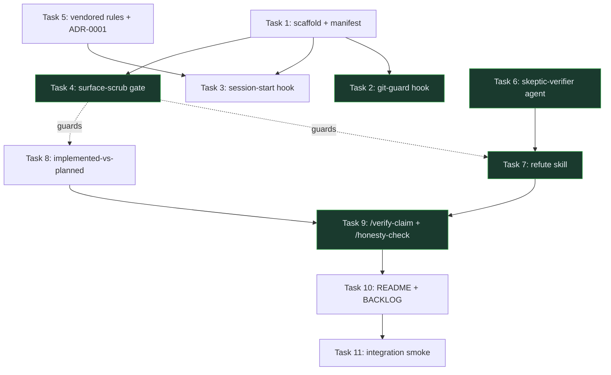
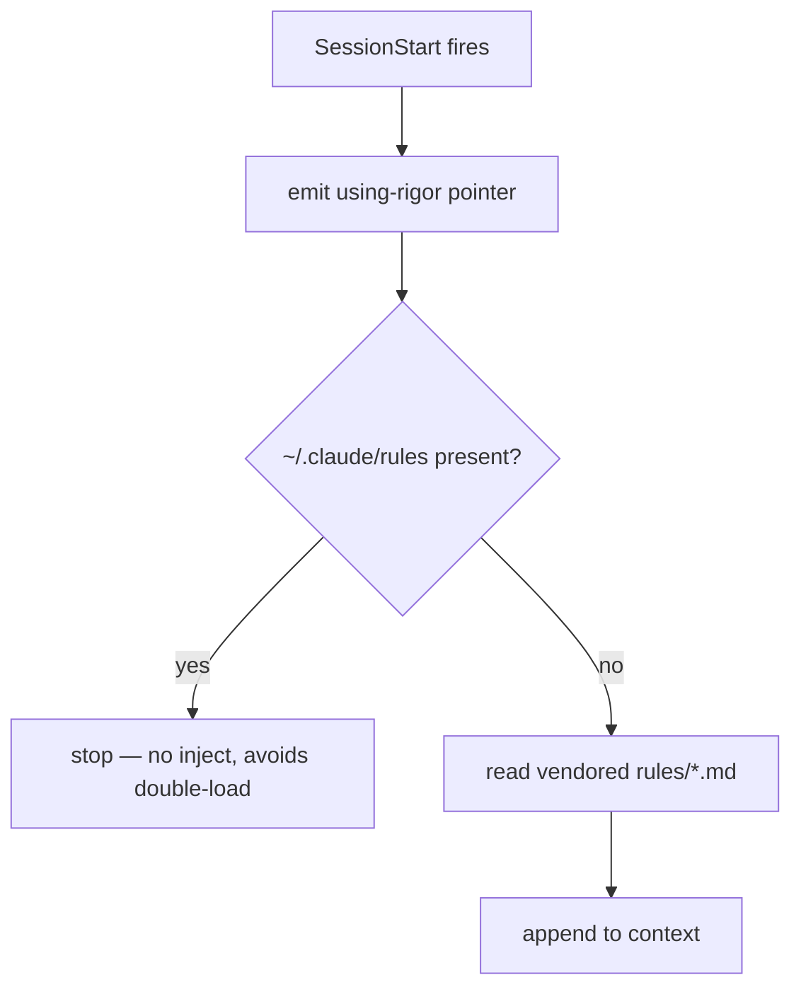

# rigor Plugin — Phase 1 (Verification Spine) Implementation Plan

> **For agentic workers:** REQUIRED SUB-SKILL: Use superpowers:subagent-driven-development (recommended) or superpowers:executing-plans to implement this plan task-by-task. Steps use checkbox (`- [ ]`) syntax for tracking.

**Goal:** Scaffold the standalone `rigor` Claude Code plugin and build its verification spine — the refute primitive, implemented-vs-planned, the skeptic-verifier agent, a git-guard hook, two commands, a session-start hook, vendored rules, and ADR-0001 — all guarded by an executable surface-scrub gate.

**Architecture:** A conventional Claude Code plugin (`.claude-plugin/plugin.json` + auto-discovered `skills/`, `commands/`, `agents/`, plus `hooks/hooks.json`). Two Node hooks (cross-platform, no Git-Bash dependency): `git-guard` (PreToolUse/Bash, blocks agent git-history writes) and `session-start` (surfaces the toolkit; injects vendored rules only when `~/.claude/rules` is absent). Enforcement infra (git-guard + a `check-surface-scrub` script) is built before the skill content it guards.

**Tech Stack:** Markdown (skills/commands/agents/ADR/docs), JSON (plugin manifest, hooks config), Node.js ≥18 (hooks + check script, ESM `.mjs`), `node:test` + `node:assert` for hook tests, git.

## Global Constraints

- **Plugin name:** `rigor`. Repo lives at `~/dev/rigor` (sibling of other dev repos). Working-name only; do not hard-code "rigor" into prose that would be wrong after a rename — keep it to paths, manifest `name`, and the `using-rigor` pointer.
- **Git is commands-for-Hossain.** The executing agent NEVER runs `git init`, `git add`, `git commit`, or `git push`. Every "Commit" step **prints the exact command for Hossain to run** and continues. This is the rule git-guard itself enforces; the plugin is built under it. (Fresh history Hossain owns.)
- **Surface-scrub (hard rule on every skill):** skill example text MUST be domain-neutral. No project fingerprints — the denylist (hard-fail) is: `ATLAS`, `COMPASS`, `ke-workbench`, `ke-cli`, `regulatory-rule-engine`, `MiCA`, `FCA`, `Temporal`, `GENIUS`, `RWA`, `postcard`, `ke-canon`. Examples must not be single-stack monoculture. `scripts/check-surface-scrub.mjs` enforces this; it must pass before any skill task is committed.
- **Provisional by default:** every skill/command/agent frontmatter carries `status: provisional`. The ONLY consumer of this field in v1 is `README.md` (it lists statuses honestly). It is not a functional gate.
- **"Extracted from one session" — never "fired once ever."** Any provisional framing in prose uses the former (honest about the *extraction*), not the latter (false — these patterns have cross-project history).
- **Node ESM:** all scripts are `.mjs`, run as `node <path>`. Target Node ≥18 (built-in `node:test`, `fs`, `path`).
- **Hook schema is version-sensitive:** Task 1 verifies the plugin actually loads and Task 2/3 verify hooks actually fire in a live `claude` instance. Treat the JSON shapes below as best-known-correct, but the empirical trigger check is the source of truth — if a shape is wrong, fix it where the trigger fails.

---

## File Structure

```
~/dev/rigor/
├── .claude-plugin/plugin.json        # manifest (name, version, description)
├── hooks/
│   ├── hooks.json                    # event → command wiring
│   ├── git-guard.mjs                 # PreToolUse/Bash: block git-history writes
│   └── session-start.mjs             # surface toolkit + inject rules iff absent
├── scripts/
│   └── check-surface-scrub.mjs       # domain-neutrality gate over skills/
├── skills/
│   ├── refute/SKILL.md               # the primitive: recompute + re-run gate + dispatch
│   └── implemented-vs-planned/SKILL.md
├── commands/
│   ├── verify-claim.md               # → refute on a self-reported pass
│   └── honesty-check.md              # → implemented-vs-planned over a path
├── agents/
│   └── skeptic-verifier.md           # vendored from ~/.claude/agents
├── rules/
│   ├── who-i-am.md … agents.md       # vendored 6 modules
│   └── PROVENANCE.md
├── docs/adr/0001-vendor-the-rules.md
├── tests/
│   ├── git-guard.test.mjs
│   └── session-start.test.mjs
├── BACKLOG.md                        # held: repo-cartographer, integration-runner, Phase 2
└── README.md
```

Phase 2 (`fanout-recon-synthesize`, `gate-discipline`, `/recon`, `/handoff`) is **out of scope** for this plan — listed in `BACKLOG.md` only.

## Build order (dependency graph)



Enforcement infra (git-guard, surface-scrub gate) lands before the skill content
it guards; refute is built before the two commands that call it.

---

### Task 1: Repo scaffold + plugin manifest + load verification

**Files:**
- Create: `~/dev/rigor/.claude-plugin/plugin.json`
- Create: `~/dev/rigor/.gitignore`

**Interfaces:**
- Produces: a loadable plugin named `rigor` at `~/dev/rigor`; `${CLAUDE_PLUGIN_ROOT}` resolves to the repo root for later hook wiring.

- [ ] **Step 1: Create the manifest**

`~/dev/rigor/.claude-plugin/plugin.json`:
```json
{
  "name": "rigor",
  "description": "Portable verification-and-discipline toolkit: refute load-bearing claims, keep built-vs-planned honest, and never let an agent write git history.",
  "version": "0.1.0",
  "author": { "name": "Hossain", "email": "hossain@pazooki.com" },
  "license": "UNLICENSED",
  "keywords": ["verification", "discipline", "honesty", "workflow"]
}
```

- [ ] **Step 2: Create `.gitignore`**

`~/dev/rigor/.gitignore`:
```
node_modules/
*.log
.DS_Store
```

- [ ] **Step 3: Verify the plugin is recognized**

Run (from any repo with Claude Code): add `~/dev/rigor` as a local plugin per current Claude Code plugin-install docs, then list plugins.
Expected: `rigor` appears in the installed/available plugin list with version `0.1.0`.
If it does not load, fix `plugin.json` against the error before proceeding — this manifest shape is the foundation for every later task.

- [ ] **Step 4: Commit (command for Hossain)**

```bash
cd ~/dev/rigor && git init
git add .claude-plugin/plugin.json .gitignore
git commit -m "chore: scaffold rigor plugin manifest"
```

---

### Task 2: git-guard hook (the inviolable rule, made hard)

**Files:**
- Create: `~/dev/rigor/hooks/git-guard.mjs`
- Create: `~/dev/rigor/tests/git-guard.test.mjs`
- Create: `~/dev/rigor/hooks/hooks.json`

**Interfaces:**
- Consumes: PreToolUse JSON on stdin: `{ "tool_name": string, "tool_input": { "command": string } }`.
- Produces: `decide(command: string, env: object) -> { block: boolean, reason?: string }` (pure, exported for tests); and a stdin/stdout wrapper that emits `{ "hookSpecificOutput": { "hookEventName": "PreToolUse", "permissionDecision": "deny"|"allow", "permissionDecisionReason": string } }`.

- [ ] **Step 1: Write the failing test**

`~/dev/rigor/tests/git-guard.test.mjs`:
```js
import { test } from 'node:test';
import assert from 'node:assert/strict';
import { decide } from '../hooks/git-guard.mjs';

const env = {}; // no override

test('blocks git commit', () => {
  assert.equal(decide('git commit -m "x"', env).block, true);
});
test('blocks git push and force push', () => {
  assert.equal(decide('git push origin main', env).block, true);
  assert.equal(decide('git push --force', env).block, true);
});
test('blocks branch -f and --no-verify', () => {
  assert.equal(decide('git branch -f main HEAD', env).block, true);
  assert.equal(decide('git commit --no-verify -m x', env).block, true);
});
test('blocks commit inside a chain', () => {
  assert.equal(decide('git add . && git commit -m x', env).block, true);
});
test('allows read-only git', () => {
  assert.equal(decide('git status', env).block, false);
  assert.equal(decide('git log --oneline -5', env).block, false);
  assert.equal(decide('git fetch origin', env).block, false);
});
test('does not false-positive on echo', () => {
  assert.equal(decide('echo "remember to git commit later"', env).block, false);
});
test('override allows when RIGOR_GIT_ALLOW=1', () => {
  assert.equal(decide('git commit -m x', { RIGOR_GIT_ALLOW: '1' }).block, false);
});
```

- [ ] **Step 2: Run the test to verify it fails**

Run: `cd ~/dev/rigor && node --test tests/git-guard.test.mjs`
Expected: FAIL — `Cannot find module '../hooks/git-guard.mjs'`.

- [ ] **Step 3: Implement the hook**

`~/dev/rigor/hooks/git-guard.mjs`:
```js
// Blocks agent-initiated git-history writes. Claude outputs the command for the
// human instead. Override per web-driven repo with RIGOR_GIT_ALLOW=1.
const BLOCKED = [
  /^git\s+commit\b/,
  /^git\s+push\b/,
  /^git\s+branch\s+(-f|--force|-D)\b/,
  /^git\s+reset\s+--hard\b/,
  /--no-verify\b/,
  /--force\b/,
];

export function decide(command, env = process.env) {
  if (env.RIGOR_GIT_ALLOW === '1') return { block: false };
  // Split on shell separators; a segment "blocks" only if its first word is git.
  const segments = String(command).split(/&&|\|\||;|\||\n/);
  for (const raw of segments) {
    const seg = raw.trim();
    if (!seg.startsWith('git ') && seg !== 'git') continue;
    if (BLOCKED.some((re) => re.test(seg))) {
      return {
        block: true,
        reason:
          'rigor git-guard: Claude does not write git history. Output the exact ' +
          'git command for the human to run, then continue. ' +
          '(Override for a web-driven repo: set RIGOR_GIT_ALLOW=1.)',
      };
    }
  }
  return { block: false };
}

// stdin/stdout wrapper (skipped under the test runner).
if (!process.env.NODE_TEST_CONTEXT) {
  let buf = '';
  process.stdin.on('data', (d) => (buf += d));
  process.stdin.on('end', () => {
    let cmd = '';
    try { cmd = JSON.parse(buf)?.tool_input?.command ?? ''; } catch {}
    const { block, reason } = decide(cmd);
    process.stdout.write(JSON.stringify({
      hookSpecificOutput: {
        hookEventName: 'PreToolUse',
        permissionDecision: block ? 'deny' : 'allow',
        permissionDecisionReason: block ? reason : 'ok',
      },
    }));
  });
}
```

**Control flow** (the branching the tests pin down):

```mermaid
flowchart TD
    A[command string] --> B{RIGOR_GIT_ALLOW=1?}
    B -->|yes| Z[allow]
    B -->|no| C[split on && || ; pipe newline]
    C --> D{segment first word = git?}
    D -->|no| E{more segments?}
    D -->|yes| F{matches a BLOCKED pattern?}
    F -->|yes| Y[block + reason]
    F -->|no| E
    E -->|yes| D
    E -->|no| Z
```

- [ ] **Step 4: Run the test to verify it passes**

Run: `cd ~/dev/rigor && node --test tests/git-guard.test.mjs`
Expected: PASS — all assertions green.

- [ ] **Step 5: Wire the hook**

`~/dev/rigor/hooks/hooks.json`:
```json
{
  "hooks": {
    "PreToolUse": [
      {
        "matcher": "Bash",
        "hooks": [
          { "type": "command", "command": "node \"${CLAUDE_PLUGIN_ROOT}/hooks/git-guard.mjs\"" }
        ]
      }
    ]
  }
}
```

- [ ] **Step 6: Verify it fires live**

In a throwaway test repo with the plugin enabled, ask Claude to run `git commit -m test`.
Expected: the call is denied with the git-guard reason; `git status` is allowed. If the deny shape is wrong, correct `hooks.json`/the wrapper output here against the observed failure.

- [ ] **Step 7: Commit (command for Hossain)**

```bash
cd ~/dev/rigor
git add hooks/git-guard.mjs hooks/hooks.json tests/git-guard.test.mjs
git commit -m "feat(hooks): git-guard blocks agent git-history writes"
```

---

### Task 3: session-start hook (surface toolkit; inject rules iff absent)

**Files:**
- Create: `~/dev/rigor/hooks/session-start.mjs`
- Create: `~/dev/rigor/tests/session-start.test.mjs`
- Modify: `~/dev/rigor/hooks/hooks.json` (add SessionStart event)

**Interfaces:**
- Consumes: nothing from stdin it needs; reads filesystem.
- Produces: `buildContext({ homeRulesPresent: boolean, vendoredRules: string }) -> string` (pure, exported); wrapper prints `{ "hookSpecificOutput": { "hookEventName": "SessionStart", "additionalContext": string } }`.

- [ ] **Step 1: Write the failing test**

`~/dev/rigor/tests/session-start.test.mjs`:
```js
import { test } from 'node:test';
import assert from 'node:assert/strict';
import { buildContext } from '../hooks/session-start.mjs';

const POINTER = 'using-rigor';

test('always includes the toolkit pointer', () => {
  const out = buildContext({ homeRulesPresent: true, vendoredRules: 'RULES' });
  assert.match(out, new RegExp(POINTER));
});
test('injects vendored rules when ~/.claude/rules is absent', () => {
  const out = buildContext({ homeRulesPresent: false, vendoredRules: 'VENDORED_BODY' });
  assert.match(out, /VENDORED_BODY/);
});
test('does NOT inject vendored rules when present (no double-load)', () => {
  const out = buildContext({ homeRulesPresent: true, vendoredRules: 'VENDORED_BODY' });
  assert.doesNotMatch(out, /VENDORED_BODY/);
});
```

- [ ] **Step 2: Run the test to verify it fails**

Run: `cd ~/dev/rigor && node --test tests/session-start.test.mjs`
Expected: FAIL — module not found.

- [ ] **Step 3: Implement the hook**

`~/dev/rigor/hooks/session-start.mjs`:
```js
import { existsSync, readdirSync, readFileSync } from 'node:fs';
import { join } from 'node:path';
import { homedir } from 'node:os';

const POINTER =
  'using-rigor: this session has the rigor toolkit. Reach for `refute` before ' +
  'trusting any load-bearing claim (recompute numbers, re-run the real gate, ' +
  'dispatch skeptics); keep built-vs-planned honest; never write git history ' +
  '(output the command for the human). Commands: /verify-claim, /honesty-check.';

export function buildContext({ homeRulesPresent, vendoredRules }) {
  let out = POINTER;
  if (!homeRulesPresent && vendoredRules) {
    out += '\n\n--- vendored operating rules (no ~/.claude/rules found) ---\n' + vendoredRules;
  }
  return out;
}

function readVendoredRules(root) {
  const dir = join(root, 'rules');
  if (!existsSync(dir)) return '';
  return readdirSync(dir)
    .filter((f) => f.endsWith('.md') && f !== 'PROVENANCE.md')
    .map((f) => `# ${f}\n` + readFileSync(join(dir, f), 'utf8'))
    .join('\n\n');
}

if (!process.env.NODE_TEST_CONTEXT) {
  const root = process.env.CLAUDE_PLUGIN_ROOT ?? process.cwd();
  const homeRulesPresent = existsSync(join(homedir(), '.claude', 'rules'));
  const context = buildContext({ homeRulesPresent, vendoredRules: readVendoredRules(root) });
  process.stdout.write(JSON.stringify({
    hookSpecificOutput: { hookEventName: 'SessionStart', additionalContext: context },
  }));
}
```

**Inject-iff-absent** (the ADR-0001 decision the tests pin down):



- [ ] **Step 4: Run the test to verify it passes**

Run: `cd ~/dev/rigor && node --test tests/session-start.test.mjs`
Expected: PASS.

- [ ] **Step 5: Add the SessionStart wiring**

Edit `~/dev/rigor/hooks/hooks.json` — add alongside `PreToolUse`:
```json
    "SessionStart": [
      {
        "hooks": [
          { "type": "command", "command": "node \"${CLAUDE_PLUGIN_ROOT}/hooks/session-start.mjs\"" }
        ]
      }
    ]
```
(The file's top-level `hooks` object now has both `PreToolUse` and `SessionStart` keys.)

- [ ] **Step 6: Commit (command for Hossain)**

```bash
cd ~/dev/rigor
git add hooks/session-start.mjs hooks/hooks.json tests/session-start.test.mjs
git commit -m "feat(hooks): session-start surfaces toolkit, injects rules iff absent"
```

---

### Task 4: surface-scrub gate (build the guard before the content)

**Files:**
- Create: `~/dev/rigor/scripts/check-surface-scrub.mjs`
- Create: `~/dev/rigor/tests/surface-scrub.test.mjs`

**Interfaces:**
- Produces: `findFingerprints(text: string) -> string[]` (pure, exported — returns matched denylist tokens); CLI wrapper scans `skills/**/SKILL.md` + `commands/*.md`, prints offenders, exits 1 if any.

> **Honesty caveat (the gate applying implemented-vs-planned to itself):** this check greps the hard-coded denylist of *named project tokens* only. It does **not** detect single-stack monoculture (all examples in one language) — that half of surface-scrub stays human judgment. A `surface-scrub: clean` result means "no named fingerprints," **not** "fully domain-neutral." Don't let the green check claim more than it verifies.

- [ ] **Step 1: Write the failing test**

`~/dev/rigor/tests/surface-scrub.test.mjs`:
```js
import { test } from 'node:test';
import assert from 'node:assert/strict';
import { findFingerprints } from '../scripts/check-surface-scrub.mjs';

test('flags project fingerprints', () => {
  assert.deepEqual(findFingerprints('see the ATLAS gate and COMPASS consumer').sort(),
    ['ATLAS', 'COMPASS']);
});
test('flags case-insensitively', () => {
  assert.ok(findFingerprints('compiled with ke-cli').includes('ke-cli'));
});
test('clean domain-neutral text passes', () => {
  assert.deepEqual(findFingerprints('a verdict claims the suite passes; re-run it.'), []);
});
```

- [ ] **Step 2: Run the test to verify it fails**

Run: `cd ~/dev/rigor && node --test tests/surface-scrub.test.mjs`
Expected: FAIL — module not found.

- [ ] **Step 3: Implement the check**

`~/dev/rigor/scripts/check-surface-scrub.mjs`:
```js
import { readFileSync, readdirSync, existsSync } from 'node:fs';
import { join } from 'node:path';

const DENY = ['ATLAS','COMPASS','ke-workbench','ke-cli','regulatory-rule-engine',
  'MiCA','FCA','Temporal','GENIUS','RWA','postcard','ke-canon'];

export function findFingerprints(text) {
  const hits = new Set();
  for (const tok of DENY) {
    if (new RegExp(`\\b${tok.replace(/[-]/g, '\\-')}\\b`, 'i').test(text)) hits.add(tok);
  }
  return [...hits];
}

function* mdFiles(root) {
  const skills = join(root, 'skills');
  if (existsSync(skills)) {
    for (const d of readdirSync(skills)) {
      const f = join(skills, d, 'SKILL.md');
      if (existsSync(f)) yield f;
    }
  }
  const cmds = join(root, 'commands');
  if (existsSync(cmds)) {
    for (const f of readdirSync(cmds)) if (f.endsWith('.md')) yield join(cmds, f);
  }
}

if (!process.env.NODE_TEST_CONTEXT) {
  const root = process.argv[2] ?? process.cwd();
  let bad = false;
  for (const f of mdFiles(root)) {
    const hits = findFingerprints(readFileSync(f, 'utf8'));
    if (hits.length) { bad = true; console.error(`SURFACE-SCRUB FAIL ${f}: ${hits.join(', ')}`); }
  }
  if (bad) { console.error('Fix: replace project fingerprints with domain-neutral examples.'); process.exit(1); }
  console.log('surface-scrub: clean');
}
```

- [ ] **Step 4: Run the test to verify it passes**

Run: `cd ~/dev/rigor && node --test tests/surface-scrub.test.mjs`
Expected: PASS.

- [ ] **Step 5: Run the gate over the (empty) repo**

Run: `cd ~/dev/rigor && node scripts/check-surface-scrub.mjs`
Expected: `surface-scrub: clean` (no skills yet).

- [ ] **Step 6: Commit (command for Hossain)**

```bash
cd ~/dev/rigor
git add scripts/check-surface-scrub.mjs tests/surface-scrub.test.mjs
git commit -m "feat(scripts): surface-scrub gate flags project fingerprints in skills"
```

---

### Task 5: Vendor the rules + PROVENANCE + ADR-0001

**Files:**
- Create: `~/dev/rigor/rules/{who-i-am,working-style,git,verification-and-honesty,workflows,agents}.md`
- Create: `~/dev/rigor/rules/PROVENANCE.md`
- Create: `~/dev/rigor/docs/adr/0001-vendor-the-rules.md`

**Interfaces:**
- Produces: `rules/*.md` consumed by `session-start.mjs` when `~/.claude/rules` is absent.

- [ ] **Step 1: Copy the six rule modules verbatim**

Read each of `~/.claude/rules/{who-i-am,working-style,git,verification-and-honesty,workflows,agents}.md` and write them unchanged to `~/dev/rigor/rules/<same-name>.md`. Do not edit content — this is a vendored snapshot.

- [ ] **Step 2: Write the provenance note**

`~/dev/rigor/rules/PROVENANCE.md`:
```markdown
# Provenance

Vendored from `~/.claude/rules/` @ 2026-06-25.

These are a point-in-time copy so the plugin is self-contained on a fresh machine
(ADR-0001). The author's `~/.claude/rules/` remains the always-on source on their
own machine; `session-start.mjs` injects this copy ONLY when `~/.claude/rules` is
absent, to avoid double-loading. Re-sync when the source rules change; bump the
date above.
```

- [ ] **Step 3: Write ADR-0001 (the repo's first ADR)**

`~/dev/rigor/docs/adr/0001-vendor-the-rules.md`:
```markdown
# ADR-0001 — Vendor the rules

**Status:** Accepted (2026-06-25)

## Context
The skills reference operating rules (who-i-am, working-style, git,
verification-and-honesty, workflows, agents). A pointer ("assume ~/.claude is
present") half-loads the plugin on a fresh machine: skills load, the judgment they
cite does not.

## Decision
The plugin vendors its own copy of those rules in `rules/`, not a pointer.
`session-start.mjs` injects the vendored copy only when `~/.claude/rules` is
absent. Self-contained beats elegant — portability is the plugin's whole purpose.

## Consequences
- The vendored copy can drift from `~/.claude/rules`. Accepted; managed by
  `rules/PROVENANCE.md` (dated) and periodic re-sync.
- A fresh clone in an unfamiliar shop loads complete and self-supplied.
```

- [ ] **Step 4: Verify session-start uses the vendored rules**

Run: `cd ~/dev/rigor && HOME=/nonexistent USERPROFILE=/nonexistent CLAUDE_PLUGIN_ROOT=$(pwd) node hooks/session-start.mjs`
(On Windows `os.homedir()` reads `USERPROFILE`, not `HOME` — both must be overridden to exercise the absent-`~/.claude/rules` injection path.)
Expected: stdout JSON whose `additionalContext` contains both `using-rigor` and content from the vendored rule files (the absent-home path injects them).

- [ ] **Step 5: Commit (command for Hossain)**

```bash
cd ~/dev/rigor
git add rules/ docs/adr/0001-vendor-the-rules.md
git commit -m "feat(rules): vendor operating rules + provenance; ADR-0001"
```

---

### Task 6: Vendor the skeptic-verifier agent

**Files:**
- Create: `~/dev/rigor/agents/skeptic-verifier.md`

**Interfaces:**
- Produces: an agent the `refute` skill dispatches by name.

- [ ] **Step 1: Copy + retag the agent**

Read `~/.claude/agents/skeptic-verifier.md`, write it to `~/dev/rigor/agents/skeptic-verifier.md`, and ensure its frontmatter carries `status: provisional` (add the field if absent; the agent fired this session but ships honestly tagged). Scrub any project-specific example text per the surface-scrub denylist.

- [ ] **Step 2: Verify it is fingerprint-clean**

Run: `cd ~/dev/rigor && node scripts/check-surface-scrub.mjs` (extend the check's scan to `agents/` if you want it gated too — optional; at minimum grep manually).
Expected: no denylist tokens in `agents/skeptic-verifier.md`.

- [ ] **Step 3: Commit (command for Hossain)**

```bash
cd ~/dev/rigor
git add agents/skeptic-verifier.md
git commit -m "feat(agents): vendor skeptic-verifier (provisional)"
```

---

### Task 7: `refute` skill (the primitive — three moves)

**Files:**
- Create: `~/dev/rigor/skills/refute/SKILL.md`

**Interfaces:**
- Produces: the `refute` skill, invoked directly by `fanout-recon-synthesize` (Phase 2) and by `/verify-claim` (Task 9).

- [ ] **Step 1: Write the skill (domain-neutral throughout)**

`~/dev/rigor/skills/refute/SKILL.md`:
```markdown
---
name: refute
description: Use before trusting or writing down any load-bearing claim — a number, a "tests pass", a subagent's "done", any assertion a decision rests on. Tries to break the claim three ways before it survives.
status: provisional
---

# Refute

A claim is "true" only after it survives a genuine attempt to break it. Run this
on any **load-bearing** claim before it goes into a doc, a commit message, a
status report, or a reply — especially a claim of success you did not personally
watch happen.

## The three moves

Apply every move that applies to the claim:

1. **Recompute.** If the claim contains an empirical number, recompute it from the
   raw source (the log, the file, the API response) at the point of claiming.
   Never restate a figure from memory or from a summary.
2. **Re-execute the gate.** If an acceptance gate exists — a test suite, a
   validator, a build, a reproducible check — run it yourself. Do not trust a
   reported pass. "The suite is green" is a claim; the green suite is the evidence.
3. **Dispatch skeptics.** Spawn independent skeptics (the `skeptic-verifier`
   agent), each prompted to *refute*, not confirm. The claim survives only if it
   withstands them; raise the vote threshold with the stakes.

## When it survives

Write the claim down with the evidence attached (the recomputed number, the gate
output, the skeptic verdicts). When it does not, say so plainly and adjust —
a flagged unknown beats a confident wrong answer.

## Example

A worker reports: "migration complete, all 412 checks pass." Refute: re-run the
check command yourself (move 2) and read the count from its output (move 1); if it
prints 0 failures over 412, dispatch two skeptics to attack the strongest-looking
claim (move 3). Only a claim that survives all three is "complete."

## Red flags that mean STOP and refute

"It probably passes." "The subagent said it's done." "I remember the number was…"
"Looks right." Each is an untested claim wearing the clothes of a fact.
```

- [ ] **Step 2: Run the surface-scrub gate**

Run: `cd ~/dev/rigor && node scripts/check-surface-scrub.mjs`
Expected: `surface-scrub: clean` (the example uses a generic "412 checks", no stack/project tokens).

- [ ] **Step 3: Commit (command for Hossain)**

```bash
cd ~/dev/rigor
git add skills/refute/SKILL.md
git commit -m "feat(skills): refute primitive (recompute + re-run gate + dispatch)"
```

---

### Task 8: `implemented-vs-planned` skill (status honesty; no recompute)

**Files:**
- Create: `~/dev/rigor/skills/implemented-vs-planned/SKILL.md`

- [ ] **Step 1: Write the skill**

`~/dev/rigor/skills/implemented-vs-planned/SKILL.md`:
```markdown
---
name: implemented-vs-planned
description: Use before writing any status into a doc, README, commit message, or reply — keeps the built-vs-proposed boundary visible so aspirational work never reads as done.
status: provisional
---

# Implemented vs planned

Keep the line between what is **built** and what is **proposed** visible
everywhere. The failure mode this prevents: a plan, a stub, or a "should work"
reading to a future reader as a finished, working thing.

## The checklist (run before status goes into writing)

1. **Tag every claim** built / in-progress / planned / deferred. If you cannot
   tag it, you do not know its state — find out.
2. **Use precise verbs.** "We built / we run / we propose / future extension" —
   never a blur that defaults to "done".
3. **Mark the boundary in the artifact itself**, not just in your head: a status
   column, a tag, an explicit "not yet" — so the reader sees it without asking.
4. **Aspirational work ships labeled provisional**, not as settled fact.

## Not in scope here

Verifying empirical numbers or re-running gates is **not** this skill — that is
`refute`. This skill is about the honesty of the *status label*; `refute` is about
the truth of the *claim*. Cross-reference, don't duplicate.

## Example

A design doc describes a feature in present tense. Before it ships, tag it:
"proposed — not built". One word turns a claim that would mislead into one that
informs.
```

- [ ] **Step 2: Run the surface-scrub gate**

Run: `cd ~/dev/rigor && node scripts/check-surface-scrub.mjs`
Expected: `surface-scrub: clean`.

- [ ] **Step 3: Commit (command for Hossain)**

```bash
cd ~/dev/rigor
git add skills/implemented-vs-planned/SKILL.md
git commit -m "feat(skills): implemented-vs-planned (status honesty)"
```

---

### Task 9: `/verify-claim` and `/honesty-check` commands

**Files:**
- Create: `~/dev/rigor/commands/verify-claim.md`
- Create: `~/dev/rigor/commands/honesty-check.md`

**Interfaces:**
- Consumes: `refute` (Task 7), `implemented-vs-planned` (Task 8).

- [ ] **Step 1: Write `/verify-claim`**

`~/dev/rigor/commands/verify-claim.md`:
```markdown
---
description: Refute a self-reported pass or load-bearing claim before trusting it.
status: provisional
---

Invoke the `refute` skill on the following claim — apply all three moves
(recompute any number from raw source, re-execute the real gate yourself, dispatch
skeptics to break it) and report what survived with evidence attached, or what
failed:

$ARGUMENTS
```

- [ ] **Step 2: Write `/honesty-check`**

`~/dev/rigor/commands/honesty-check.md`:
```markdown
---
description: Run the implemented-vs-planned checklist over a doc, diff, or status before publishing.
status: provisional
---

Invoke the `implemented-vs-planned` skill over the target below (a file path, a
diff, or pasted status text). Tag each claim built/in-progress/planned/deferred,
flag any aspirational work reading as done, and report the precise-verb fixes —
do not change empirical numbers (that is `/verify-claim`):

$ARGUMENTS
```

- [ ] **Step 3: Run the surface-scrub gate**

Run: `cd ~/dev/rigor && node scripts/check-surface-scrub.mjs`
Expected: `surface-scrub: clean`.

- [ ] **Step 4: Commit (command for Hossain)**

```bash
cd ~/dev/rigor
git add commands/verify-claim.md commands/honesty-check.md
git commit -m "feat(commands): /verify-claim and /honesty-check"
```

---

### Task 10: README + BACKLOG

**Files:**
- Create: `~/dev/rigor/README.md`
- Create: `~/dev/rigor/BACKLOG.md`

- [ ] **Step 1: Write the README**

`~/dev/rigor/README.md`:
```markdown
# rigor

A portable Claude Code plugin packaging a verification-and-discipline toolkit:
refute load-bearing claims, keep built-vs-planned honest, and never let an agent
write git history.

## What's in v1 (the verification spine)

| Component | Kind | Status |
|---|---|---|
| `refute` | skill | provisional |
| `implemented-vs-planned` | skill | provisional |
| `skeptic-verifier` | agent | provisional |
| `/verify-claim`, `/honesty-check` | commands | provisional |
| `git-guard` | hook (enforced) | provisional |
| `session-start` | hook | provisional |

**`status: provisional` means:** *extracted from one working session and not yet
validated as a packaged skill across multiple unfamiliar domains.* It does **not**
mean "used only once" — these patterns have cross-project history. The status field
is read by **this README only**; it is not a functional gate. A component becomes
`settled` after it survives ≥2 independent contexts (logged in `FEEDBACK.md`).

## Install

Add this repo as a local Claude Code plugin (see current Claude Code plugin docs).
On a machine without `~/.claude/rules`, the `session-start` hook injects the
vendored rules (`rules/`, see ADR-0001) so the toolkit is self-contained.

## The one hard rule

`git-guard` blocks agent-initiated `git commit`/`push`/force/`branch -f`. Claude
outputs the command for you to run. Override per web-driven repo with
`RIGOR_GIT_ALLOW=1`.

## Tests

`node --test` (hooks + surface-scrub). `node scripts/check-surface-scrub.mjs`
gates skill/command examples against project fingerprints.

## Roadmap

See `BACKLOG.md` — Phase 2 (gate-discipline, fanout-recon-synthesize, /recon,
/handoff) and held agents accrete by use.
```

- [ ] **Step 2: Write the BACKLOG**

`~/dev/rigor/BACKLOG.md`:
```markdown
# Backlog (accretes by use)

## Phase 2 — operating-system layer
- `gate-discipline` skill — acceptance criteria before starting; no stage until
  prior green; close via PR not a local pointer; ADR when criteria can't be met.
- `fanout-recon-synthesize` skill (+ `/recon`) — disjoint parallel recon → refute
  survivors → synthesize.
- `/handoff` command + template — "read this first" brief (state, locked
  decisions, reuse map, invariants).

## Held agents (did NOT fire as named agents in the source session)
- `repo-cartographer` — its job was done by generic explore agents; migrate when
  the named agent actually fires.
- `integration-runner` — its job was done inline by the operator; migrate when it
  actually fires.

## Promotion
A component moves provisional → settled after surviving ≥2 independent domains;
record the evidence in `FEEDBACK.md`.
```

- [ ] **Step 3: Commit (command for Hossain)**

```bash
cd ~/dev/rigor
git add README.md BACKLOG.md
git commit -m "docs: README (honest provisional framing) + BACKLOG"
```

---

### Task 11: Spine integration verification

**Files:** none created — this task produces evidence.

- [ ] **Step 1: All tests green**

Run: `cd ~/dev/rigor && node --test`
Expected: all git-guard + session-start + surface-scrub tests PASS, 0 failures.

- [ ] **Step 2: Surface-scrub clean across all content**

Run: `cd ~/dev/rigor && node scripts/check-surface-scrub.mjs`
Expected: `surface-scrub: clean`.

- [ ] **Step 3: Live plugin smoke**

With the plugin enabled in a throwaway repo: (a) confirm the `session-start`
context appears (the `using-rigor` pointer); (b) ask Claude to `git commit` →
denied by git-guard; (c) run `/verify-claim the suite passes` → Claude invokes
refute's three moves; (d) run `/honesty-check README.md` → Claude tags
built-vs-planned. Record the four outcomes.
Expected: all four behave as specified. Fix any wiring at the point of failure.

- [ ] **Step 4: Commit (command for Hossain)**

```bash
cd ~/dev/rigor
git tag v0.1.0
# (push when ready — your call, your history)
```

---

## Self-Review

**1. Spec coverage:** refute 3-move primitive (T7) ✓ · implemented-vs-planned without recompute, cross-ref refute (T8) ✓ · skeptic-verifier shipped, others held (T6, T10 BACKLOG) ✓ · git-guard (T2) ✓ · session-start inject-iff-absent (T3) ✓ · /verify-claim + /honesty-check (T9) ✓ · plugin.json (T1) ✓ · ADR-0001 + vendored rules + provenance (T5) ✓ · surface-scrub as executable gate (T4, run in T6–T9, T11) ✓ · provisional tagging with README-only consumer stated (T10) ✓ · "extracted from one session" framing (T10) ✓ · Phase 2 out of scope, in BACKLOG (T10) ✓ · git = commands-for-Hossain (Global Constraints + every commit step) ✓. No gaps.

**2. Placeholder scan:** every code/content step contains complete content; no TBD/TODO. The only deferred items (exact plugin-install command, exact hook JSON shape) are gated by live verification steps (T1.3, T2.6, T3, T11.3) rather than guessed — by design, since that schema is version-sensitive.

**3. Type consistency:** `decide(command, env)` (T2) used consistently; `buildContext({homeRulesPresent, vendoredRules})` (T3) matches its test; `findFingerprints(text)` (T4) matches its test and CLI; `refute` (T7) is the name dispatched by T9's `/verify-claim` and referenced by T8's cross-ref. Consistent.
